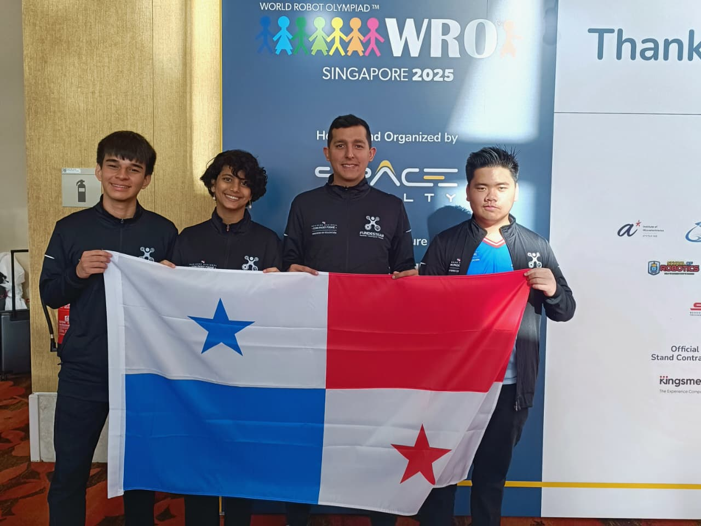
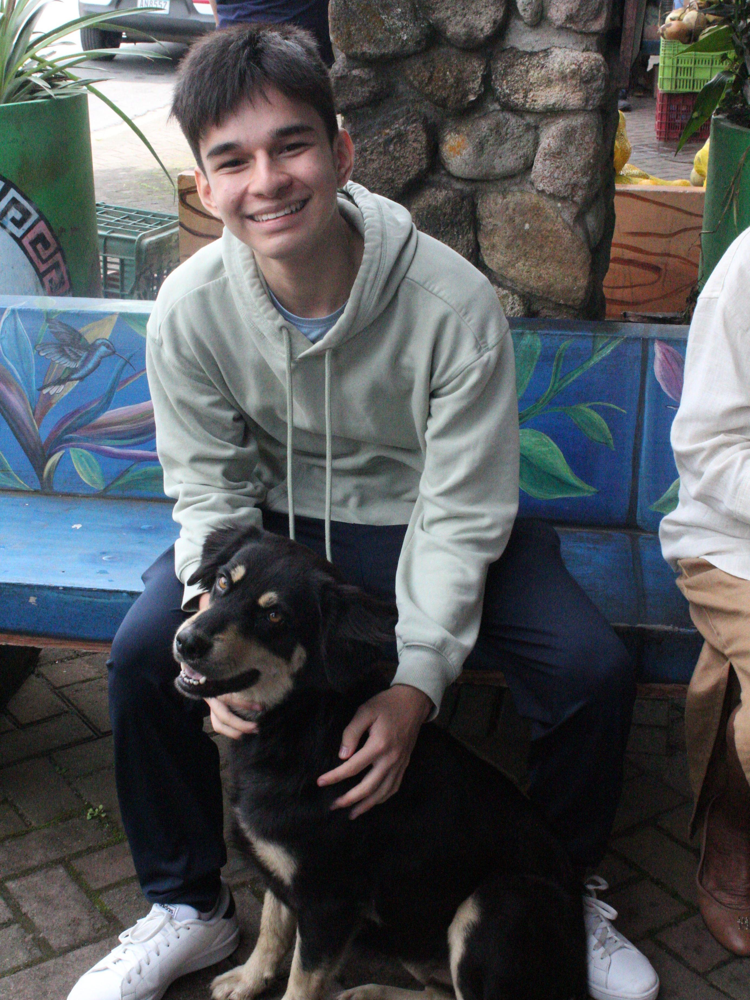
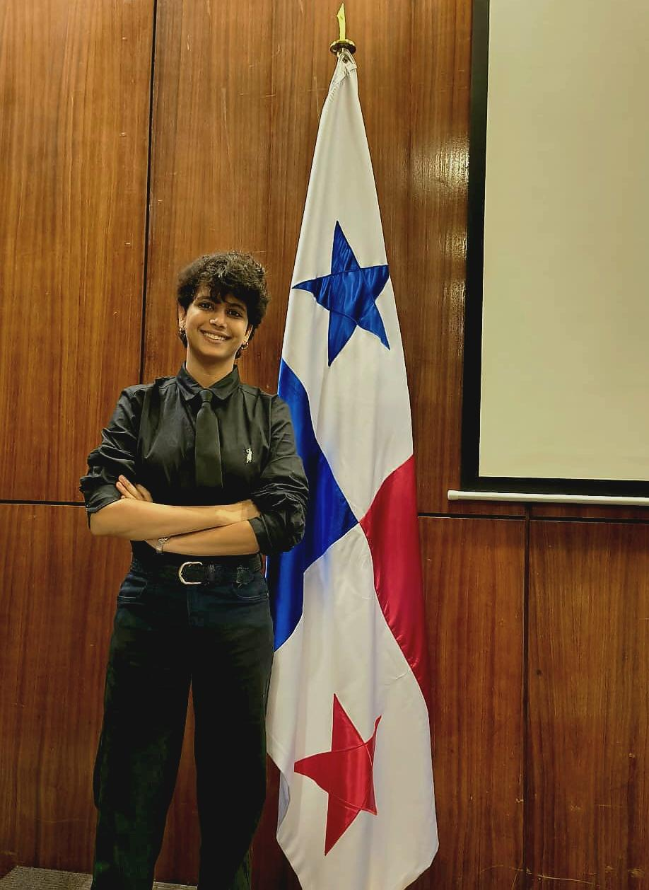
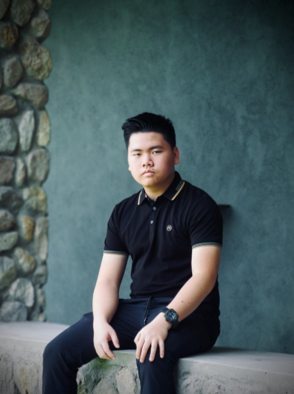
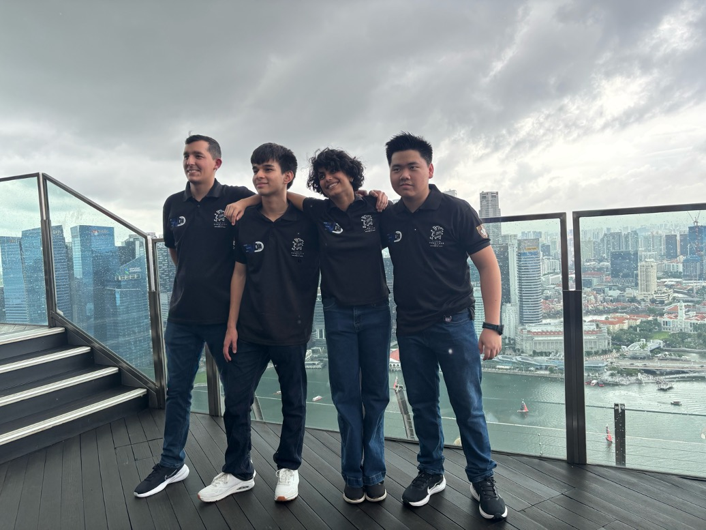

# WRO VizDrive 2026

 

Welcome to the project repository for the **Panamanian 🔴⚪🔵 Team VizDrive** for the **World Robot Olympiad (WRO)** 2026!
Here you will find all the documentation, source code, images, and models related to our autonomous robot.

## About VizDrive's Legacy

VizDrive started in 2025, and now keeps thriving with the same young Panamanians that started the project. For this updated 2026 repository, we have kept ViZio's previous versions for better understanding and comparison from our engineering process.

## Project Summary

VizDrive's core, ViZio, is an autonomous robot designed to navigate a closed-loop circuit, maintaining a stable trajectory with gyroscopic correction. It uses artificial vision, in conjunction with ultrasonic and color sensors, to detect walls and avoid obstacles.

We are participating in the **Future Engineers Category** to develop our skills and demonstrate the capabilities of young Panamanians in a competitive field like robotics.

During the creation of our robot, we tried to push the **fundamentals of robotics** to the highest we could. As you go through this GitHub repository, you may notice that we worked with very basic sensors (the kind typically found in standard Arduino kits), and that we strived to optimize them to the best of our capacities. This is because we aimed to make our build accessible for everyone, and show that even with the simplest components, it is possible to create truly functional robotic systems.

> [!NOTE]
> Throughout the competition, we are constantly making modifications in the software and hardware of our robot. We try to update on all the changes we make, but if you notice any inconsistency between the pages of the documentation, please let us know!

---

## General Project Index

You can use this index to navigate through our robot's documentation. Each document provides detailed information on every aspect of its operation:

* [**1. General Project Overview**](./docs/01_project_overview.md)
  * General and concise introduction to the robot and its main components.
  * Describes the robot's operational phases and workflow diagram.
* [**2. Hardware and Components of the Robot**](./docs/02_hardware_components.md)
  * Detailed specifications of all integrated electronic and mechanical hardware.
  * [General Electromechanical Diagram](./schemes/electromechanical_diagram.png)
  * [Circuit Interactive Design (Cirkit)](https://vd-wro.github.io/VD26/embeds/interactive_circuit)
  * [KiCad Files](./src/kicad_pcb)
* [**3. Software Architecture**](./docs/03_software_architecture.md)
  * Overview of software libraries, core functionalities, and code structure.
  * [Autonomous Driving Code](./src/main_control/Vizdrive_WRO_code.ino)
* [**4. Sensor and Pin Configurations**](./docs/04_sensors_and_pin_configuration.md)
  * In-depth review of each sensor, its role in the functionality, and Arduino pin assignments.
  * [Sensors' Test Codes](./src/test_code/)
* [**5. Robot Mobility Functionality**](./docs/05_robot_mobility.md)
  * Focuses on the robot's motion system, motor configuration, and steering mechanisms.
* [**6. PID Control for the Gyroscope**](./docs/06_pid_gyroscope_control.md)
  * Explains the MPU gyroscope implementation and PID control for trajectory stability.
  * [MPU Calibration Code](./src/mpu_orientation_control/mpu_calibration/mpu_calibration.ino)
  * [MPU Calibration Data Graph](./assets/data_graphs/MPU%20Calibration%20Data%20Analysis.xlsx)
* [**7. Computer Vision Functions with PixyCam 2.1**](./docs/07_computer_vision.md)
  * Covers the PixyCam's vision-based obstacle evasion.
  * [Computer Vision Code](./src/computer_vision/computer_vision.ino)
* [**8. Ultrasonic Distance Sensing and PID**](./docs/08_ultrasonic_distance_sensing.md)
  * Covers the distance measurement and wall avoidance with ultrasonic sensors, and the filters implemented to adjust precision.
  * Introduces and explains the side PID system for straight-line driving.
  * [Ultrasonic Sensor Data Analysis](./assets/data_graphs/Ultrasonic%20Sensors%20Data%20Analysis.xlsx)
* [**9. Color Detection Functions**](./docs/09_color_detection.md)
  * Explains the color sensor's applications and calibration.
* [**10. 3D Modeling and Fabrication**](./docs/10_3d_modeling.md)
  * Details the 3D design process, mechanical characteristics, and fabrication parameters.
  * [3D Models STL](./models/)
* [**11. Other Resources and User Manual**](./docs/11_other_resources.md)
  * User manual for robot's construction and operation.
  * Summarized documentation and additional relevant resources and materials.
  * Evolution and improvements made within the versions of the robot.
  * Technical issues and applied fixes.

---

## ViZio Versions

| Versions                  | Problems | Improvements made          | Used In          | 
| :--------------------------- | :--------------------------- | :------------------------------------------- | :--------------------------------- | 
| Prototype               |     Often finding disconnected components,                    | N/a               | First prototype made. |
| ViZio                |     Gyroscope callibration, partial parking, connection problems due to cable wear, complications with the dual ultrasonic sensor radar.                    | Removed clutter with a hand-soldered PCB.                 | 🇵🇦 Regionals 2025 |
| ViZio 2.0     |          Challenges with Pixy Parameters' callibration, incomplete parking maneuver, inverted SDA and SCL pins           | Improved PCB, kept one frontal ultrasonic, new logic for parallel parking,      | 🇵🇦 National 2025 |
| ViZio V3                   |          Block color detection through Pixy, slower velocity.                | Fixed PCB, adaption to camera bug, new parallel parking logic that includes last block evasion.                 | 🇸🇬 WRO 2025 |
| ViZio IV    |              N/a     | Changed camera, improved chassis, upgraded PCB, and added mechanical differential.      | 🇵🇦 Regionals 2026 |

For better comprehension please visit [**Previous Versions of our Robot**](./docs/11_other_resources.md#119-version-history)

---

## Photos and Videos

* **Team Photos:** [View Photos](./t-photos/README.md)
* **Vehicle Photos:** [View Photos](./v-photos/README.md)
* **Demonstration Videos:** [View Videos](./video/README.md)

---

## Source Code

All control and test codes are located in the `src/` folder.

* [Autonomous Driving (Obstacle Avoidance)](./src/main_control/Vizdrive_WRO_code.ino)
* [Autonomous Driving (No Obstacle Avoidance)](./src/main_control/Open_Round.ino)
* [MPU Orientation Control (PID and Calibration)](./src/mpu_orientation_control/pid_gyroscope.ino)
* [Computer Vision (PixyCam 2.1)](./src/computer_vision/computer_vision.ino)
* [Sensors' Test Codes](./src/test_code/)

---

## 3D Models

Files for 3D printed components are located in the `models/` folder in `.stl` files.
To access interactive models of each component, hosted in GitHub pages, visit `embeds/`.

* [Robot 3D Models](./models/)
* [Interactive 3D Models](./embeds/)

A version of our Unity Simulator, used during the robot's construction and planification process, is available as an HTTP embed, hosted with GitHub pages.

* [Unity Simulator Information](./embeds/Unity_simulator)
* [Unity Web Player](https://vd-wro.github.io/VD26/embeds/Unity_simulator/)

---

## Diagrams and Graphs

Flowcharts, circuits, and relevant data graphs.

* [Operation Flowcharts](./assets/flowcharts)
* [Calibration Data Graphs](./assets/data_graphs/)
* [Additional Hardware Photos](./assets/hardware_photos/)

---

## Team Members 🙋‍♂️🙋‍♀️🙋

|                                                       |                                                              |                                                        |
|:-----------------------------------------------------:|:-----------------------------------------------------------:|:-------------------------------------------------------:|
|        |  |              |
| [**ALEXIS PALACIOS NG**](./t-photos/meet_the_team/Alexis.md)   *Software Engineer*       | [**AISLINN CHAWLA ARORA**](./t-photos/meet_the_team/Aislinn.md)   *Logistics and Creativity*        |  [**CARLO HO NG**](./t-photos/meet_the_team/Carlo.md)   *Hardware Engineer*   |
Sensor Integration,  Firmware Architecture,  Code Logic,  Error Management,  Data Analysis,  GitHub Repository | Engineering Journal,  Photography and Film,  Competition Planning,  Drafting,  Soldering,  GitHub Repository|  Construction,  Wiring,  Circuit and PCB Design,  Power Management,  3D Modeling and Planning,  Animation and Illustration  |

---

## Branding

This is a new [section](./docs/11_other_resources.md#118-branding) for the 2026 season, where we explain our name and visuals.

---

## Special Thanks

We are profoundly thankful to everyone who has supported us on our journey so far! We're incredibly grateful to our school administration for providing the resources and trust needed to pursue this challenge. To our teachers, thank you for your guidance and advice during our preparation; we especially appreciate your patience with our absences for robot practices (we promise to catch up on our assignments after the Olympiad 😅). A special shout-out to our friends who spent their free time supporting us, cheering us on, and helping us stay up to date. To our amazing parents, your assurance and belief in us have been the foundation of our efforts, allowing us to participate even though it meant missing many classes. And last but certainly not least, to our incredible coach, Professor Agustín Rogelio Orro Pérez. Even while mentoring five other teams, you still found time to guide us through it all. Your expertise, leadership, and dedication have been invaluable for us.

Thank you all!

---

For any inquiry, question, or recommendation, feel free to contact us via email: **<vizdrive.wro@gmail.com>**
