# 2. Robot Hardware and Components

This section provides a detailed enumeration and description of all hardware components integrated into the robot and their specifications.

## 2.1 Main Control and Processing Unit

### **Component:**  **MEGA 2560 Pro Embed**

* **Quantity:** 1
* **Voltage:** 5V (operating), 7-9V (Vin)
* **Description:** Serves as the main controller board, based on the ATmega2560 microcontroller. It processes all sensor data, executes control algorithms, and manages actuation.
* **Features:** 54 digital I/O pins, 16 analog inputs, 256 KB flash memory, and 16 MHz clock speed.

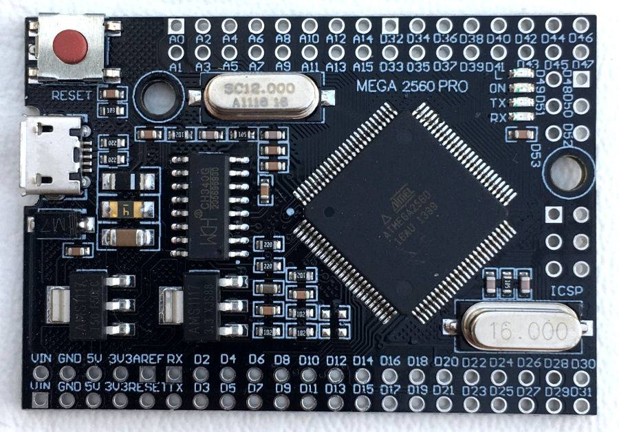

## 2.2 Motion System Components

### **Component:** **Hobby Gearmotor with 48:1 gearbox**

* **Quantity:** 1
* **Voltage Range:** 3-12V (operating at ~8V)
* **Current Consumption** ~120 mA
* **Stall Torque:** ~1.5 kg·cm (0.15 N·m)
* **Stall Current:** ~1.6 A
* **Description:** A brushed DC motor with an integrated gearbox for increased torque. Utilized for rear-wheel propulsion.

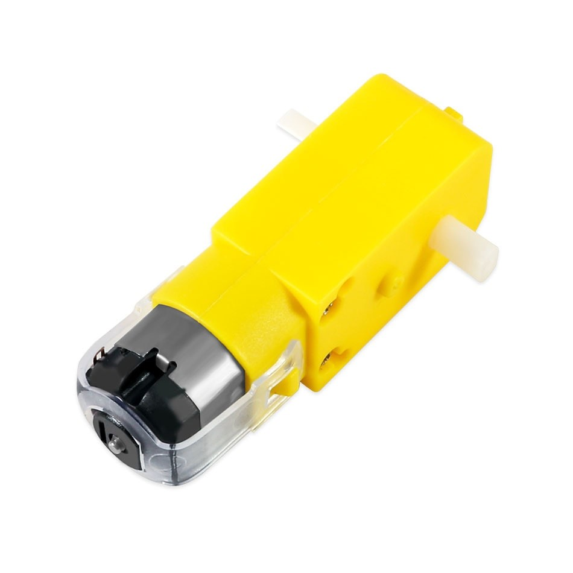

### **Component:** **Servo Motor MG90S**

* **Quantity:** 1
* **Voltage Range:** 4.8-6V
* **Current Consumption:** ~250 mA (max)
* **Torque:** 1.8 kg·cm @ 5V (0.18 N·m)
* **Description:** A micro servo motor employed for front-wheel steering. Operates via PWM signal.

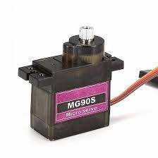

### **Component:** **Mini L298N Motor Driver**

* **Quantity:** 1
* **Logic Voltage:** 5V
* **Motor Voltage Range:** Up to 12V
* **Current Output:** Up to 2A per channel
* **Description:** A dual H-bridge motor driver responsible for interfacing the low-current control signals from the Arduino Mega to the higher-current requirements of the DC motors.

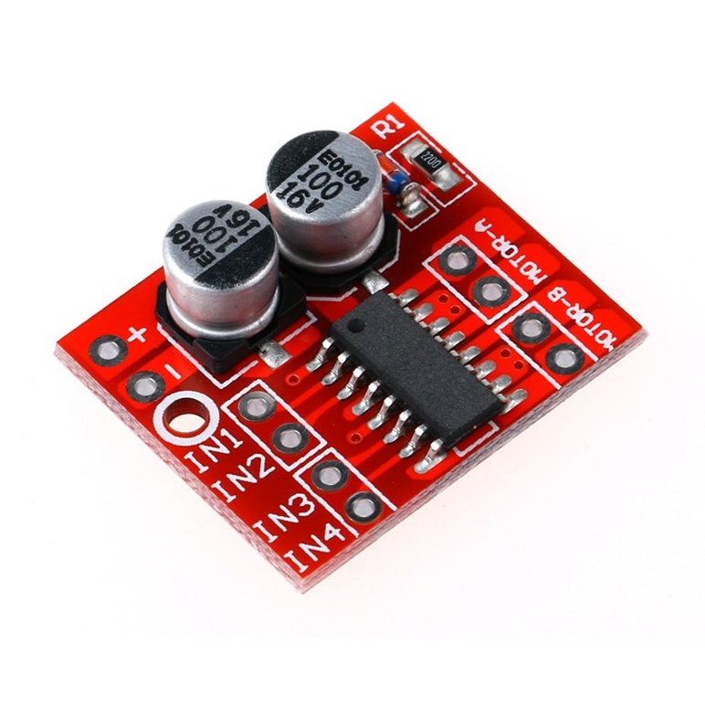

### **Mechanism**: **Mechanical Differential**

* **Quantity**: 1
* **Gear Ratio**: 1.8:1
* **Material**: Nylon and steel.
* **Description**: A gear assembly that splits engine torque evenly between two wheels while allowing them to rotate at different speeds.

## 2.3 Sensor Suite

### **Component:** **PixyCam 2.1 (Replaced by the OpenMV in ViZio IV)**

* **Quantity:** 1
* **Voltage:** 5V
* **Current Consumption:** ~140 mA
* **Interface:** ICSP
* **Description:** Smart vision sensor for real-time color and object recognition. Used for obstacle detection. For information regarding removal, please refer to: [Component Selection](#27-component-selection).

### **Component:** **OpenMV H7 Plus**

* **Quantity:** 1
* **Voltage:** 3.6–5V (via VIN) / 3.3V logic (5V tolerant for most pins)
* **Current Consumption:** ~140 mA
* **Interface:** USB, UART, I²C, SPI
* **Description:** Embedded machine-vision camera module capable of real-time image processing using MicroPython. It includes an STM32H7 microcontroller and camera sensor, allowing tasks such as color tracking, object detection, line following, and AprilTag recognition. In this project it is used for obstacle detection and color-based navigation.

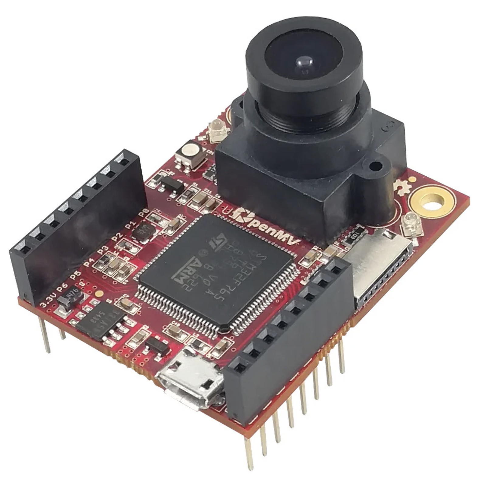

### **Component:** **TCS3472 Color Sensor**

* **Quantity:** 1
* **Voltage:** 3.3-5V
* **Current Consumption** ~235 µA (active)
* **Interface:** I2C
* **Description:** High-resolution color sensor with IR filtering. Mounted underneath the robot to detect blue and orange floor lines that indicate turns.

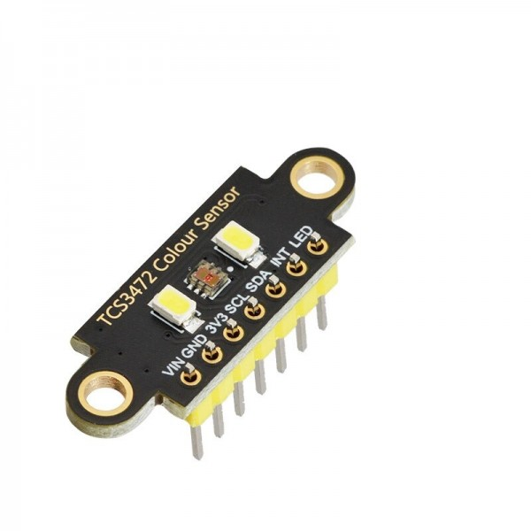

### **Component:** **TCS3200 Color Sensor (Removed in ViZio 2.0)**

* **Quantity:** 2
* **Voltage:** 2.7-5.5V
* **Power Consumption:** ~10-50 mA
* **Output:** Frequency proportional to color intensity
* **Description:** Side-mounted color recognition sensors used for detecting the magenta signal for parking. Converts color input to frequency output.

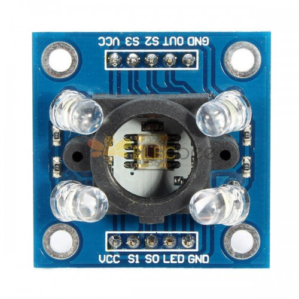

### **Component:** **HC-SR04 Ultrasonic Sensors**

* **Quantity:** 4
* **Voltage:** 5V
* **Current Consumption:** ~15 mA
* **Range of Detection:** ~2 cm to ~4 m
* **Description:** Distance sensors placed at the front and rear utilized for measuring real-time distances to walls, used for collision avoidance and maintaining orientation.

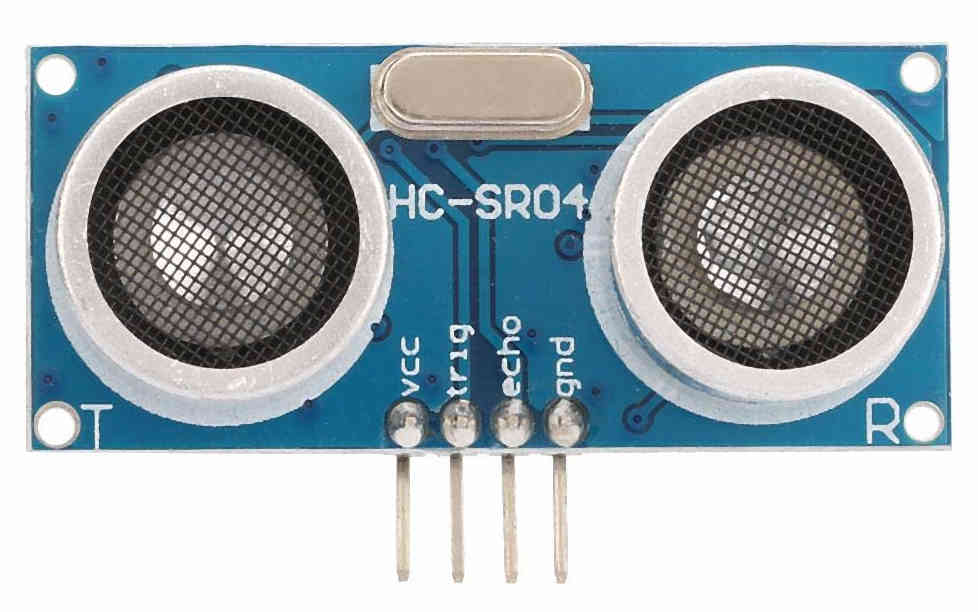

### **Component:** **MPU6050 Accelerometer + Gyroscope**

* **Quantity:** 1
* **Voltage:** 3.3-5V
* **Current Consumption:** ~3.8 mA
* **Interface:** I2C
* **Description:** A 3-axis MPU providing acceleration and angular velocity data, used for angle correction and maintaining trajectory stability through PID control.

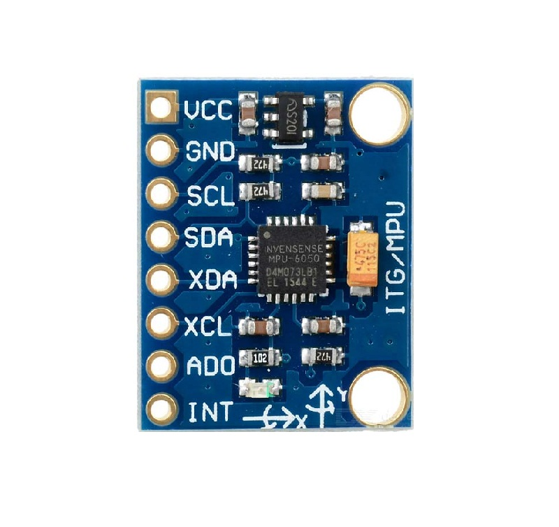

### **Component:** **Infrared Optocoupler Encoder**

* **Quantity:** 1
* **Voltage:** 3.3-5V
* **Current Consumption:** <20 mA
* **Description:** A laser interruption-based encoder used for detecting rotational position, enabling accurate measurement of distance and speed (odometry).

## 2.4 Power Supply and Regulation

### **Component:** **4.2V batteries/3.7V**

* **Quantity:** 2
* **Voltage:** 4.2V fully charged, 3.7 nominal
* **Capacity:** 8800 mAh, 5000 mAh
* **Discharge Current:** Up to 2A (depending on model)
* **Description:** Power supply for the robot's DC motors and auxiliary LED headlights. Specifically, **Li-ion 18650 Battery 4.2V 8800 mAh** and **Li-ion 18650 Battery 3.7V 5000 mAh** are used alternatively.

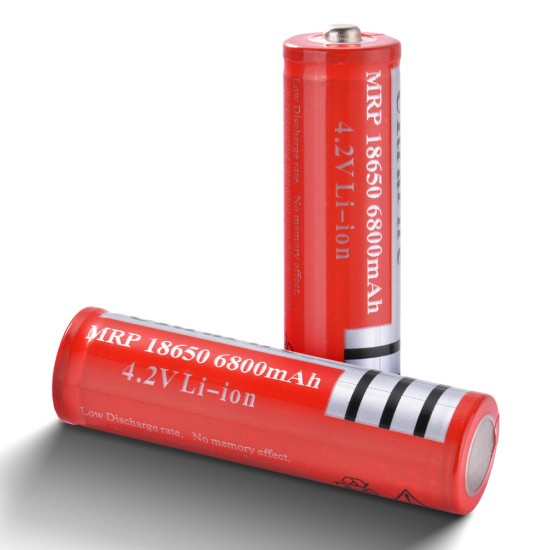

### **Component:** **Rechargable 9V Battery**

* **Quantity:** 1
* **Voltage:** 9V nominal
* **Capacity:** ~600 mAh
* **Description:** A standard 9V battery used for the sensors and Arduino MEGA unit.

## 2.5 Miscellaneous Components

  ### **Component:** **Custom Chassis (RWD)**

  * **Quantity:** 1
  * **Material:** 3D printed (PLA)
  * **Description:** A 3D designed rear-wheel drive chassis designed to house motors, mounts, sensors, battery holders, mechanical differential, and the controller.

  [**3D Modeling**](./10_3d_modeling.md)

  ### **Component:** **Pushbutton**

  * **Quantity:** 1
  * **Voltage Handling:** Signal-level (logic input)
  * **Current:** <10 mA
  * **Description:** A momentary switch used to initiate the main program.

  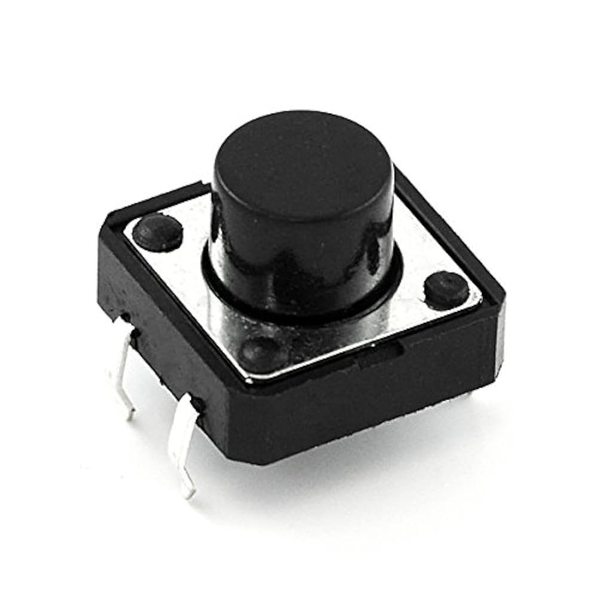

  ### **Component:** **Self-Locking Push Button Switch**

  * **Quantity:** 1
  * **Voltage Handling:** Up to ~12V
  * **Current:** Up to ~500mA
  * **Description:** A switch for toggling between two states, serving as the main power switch for the robot.

 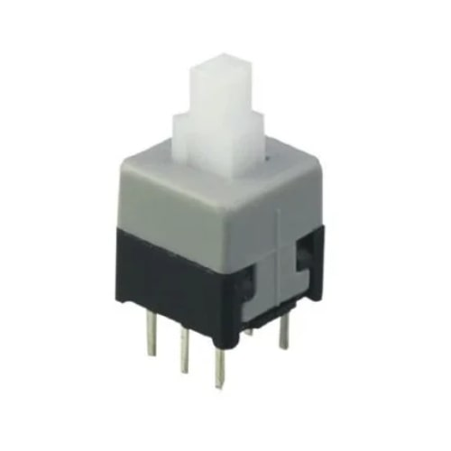

  ### **Component:** **LED**

  * **Quantity:** 1
  * **Forward Voltage:** ~3V
  * **Current:** ~10-20 mA
  * **Description:** A standard blue LED used as a visual indicator, signaling program readiness.

  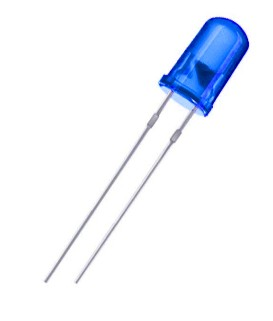

  ### **Component:** **Headlight LEDs**

  * **Quantity:** 2
  * **Forward Voltage:** ~3V
  * **Current:** ~10-20 mA
  * **Description:** Standard white LEDs used as headlights for the bot.

  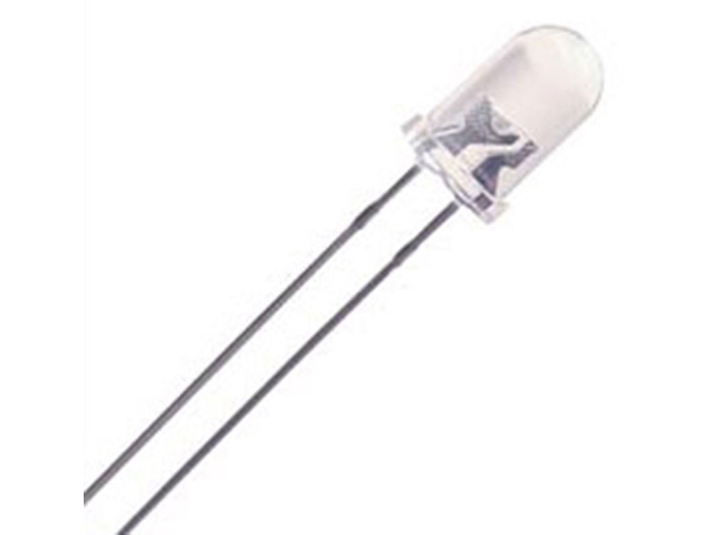

  ### **Component:** **Resistor**

  * **Quantity:** 2
  * **Resistance:** 330Ω, 10kΩ
  * **Description:** Current-limiting resistor for the LED indicator 
  and pushbutton.
  
  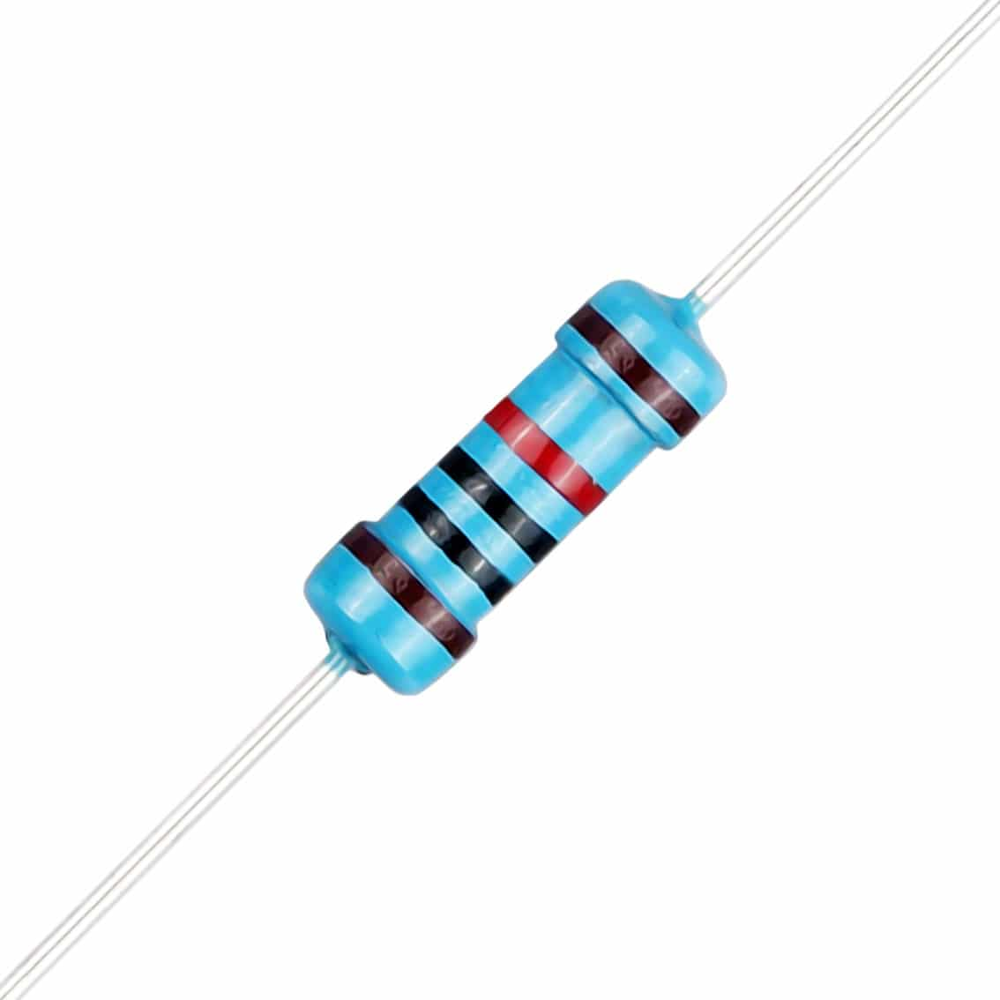

## 2.6 Power Management  

The robot integrates a **dual-supply power architecture** to balance performance, efficiency, and protection of sensitive electronics:  

### Motor Power Supply  
* **Source:** **2x** [4.2V 18650 Li-ion Battery (8800 mAh)](#component-42v-batteries37v)  
* **Load:** [DC gearmotor](#component-hobby-gearmotor-with-481-gearbox), [L298N motor driver](#component-mini-l298n-motor-driver) + [LED Headlights](#component-headlight-leds) (optional)  
* **Current Draw:**  
  * ~120 mA average during motion  
  * +40 mA with headlights (2 × 20 mA)  
  * Up to ~1.6 A at stall (short bursts only)  
* **Estimated Runtime:**  
  * Continuous average draw (~120 mA): ~70 hours  
  * With headlights (~160 mA): ~55 hours  
  * Realistic mixed load with peaks: **~10–12 hours** of operation  

This battery is dedicated to propulsion and lighting, ensuring that motor noise and current surges do not affect sensor accuracy or logic circuits while maintaining long-lasting illumination for optimal operation.

### Logic and Sensor Power Supply

* **Source:** [Rechargeable 9 V Battery (~600 mAh)](#component-rechargable-9v-battery)
* **Load:** [MEGA 2560 Pro](#component--mega-2560-pro-embed) (voltage regulator) + [PixyCam](#component-pixycam-21-replaced-by-the-openmv-in-vizio-iv) + [MPU6050](#component-mpu6050-accelerometer--gyroscope) + [Color Sensor](#component-tcs3472-color-sensor) + [Ultrasonics](#component-hc-sr04-ultrasonic-sensors)  
* **Current Draw:**  
  * MEGA 2560 Pro: ~50–70 mA  
  * PixyCam: ~140 mA  
  * MPU6050: ~4 mA  
  * TCS3472 Color Sensor: ~0.24 mA  
  * Ultrasonic Sensors (x3): ~60 mA total  
  * **Total Average:** ~260–300 mA  
* **Estimated Runtime:**  
  * ~600 mAh / 280 mA ≈ **2 hours** continuous operation  
  * Recommended use time ≈ **1 hour** for best performance

This battery ensures clean and stable voltage delivery for sensors and the controller.  

### Voltage Regulation

* The **MEGA 2560 Pro** regulates the 9V input to 5V for its logic and peripherals.  
* I²C devices (MPU6050, color sensors) operate safely at 3.3–5V.  

### Switching and Protection

* **[Main Switch](#component-self-locking-push-button-switch)**: Master power cutoff for the system.  
* **[Pushbutton](#component-pushbutton)**: Starts the main program after initialization.  
* **[330Ω and 10kΩ Resistor](#component-resistor)**: Ensures safe current limiting for the LED indicator and facilitates pushbutton grounding.
* **[LED Indicator](#component-led)**: Shows program readiness.  
* **[Headlight LEDs (x2)](#component-headlight-leds)**: White LEDs for illumination during operation.  

**Summary of Power Autonomy**  

* **Motors (4.2V Li-ion):** 12–15 hours (practical runtime)
* **Logic & Sensors (9V battery):** ~2 hours (main limiting factor)  

The system's autonomy is therefore governed by the 9V supply, after which recharging or replacement is required.

## 2.7 Component Selection

In this section, we detail our component seleciton process, possible alternatives and workarounds.

### **Controller:** Mega 2560 Pro Embed

We chose the Mega 2560 for **simplicity**, not because the microcontroller is simple on itself, but rather it makes construction much easier.

* It comes with a **voltage regulator** that accepts 9V, this eliminates the need for external voltage regulators/step-downs
* Offers outstanding power output, making power management more compact and removing the need for an additional power supply module.
* 5V logic matches most standard sensors; a voltage converter is not needeed.
* It's compactness and pin availability made prototiping more flexible.

**Compared to other common options:**

|    |   |
|:--:|:--|
|**Arduino Uno**|Not compact enough, scarce pin availability.|
|**Arduino Mega**|Very bulky.|
|**Arduino MKR models**|Strict power input and low power output, 3V3 logic, more information at [Arduino MKR1010 PCB](#arduino-mkr1010-circuit-pcb).|
|**Arduino Nano**|Scarce pin availability.|

We also chose not to use microcomputers such as **Raspberry** mainly due to 3V3 logic complexity. We constantly avoid 3V3 logic since we focus on **prototyping easiness**.

### **Artificial Vision:** OpenMV H7

The PixyCam 2.1 was a great option, it offered many advantages compared to other models:

* **Simple Inteface:** It is easy to set-up and tune, but also excellent for quick calibrations during the competition.
* **Simple Algorithms:** PixyCam uses **color-based object recognition**, this allows the PixyCam to have in-board artificial vision at 60 Hz without the need to rely with an external computer for processing.

Due to bugs, this year we implemented the OpenMV H7 Plus camera, offering much better processing power, image color quality and program flexibility.

* OpenMV H7 Plus
  * ARM Cortex-M7
  * 480 MHz CPU
  * CoreMark ≈ 2400
  * 32 MB frame buffer RAM
  * 16 MB flash storage

* Pixy 2.1
  * NXP LPC4330
  * 204 MHz dual-core MCU
  * 264 KB RAM
  * 2 MB flash

Besides having powerful specs, it is fully programmable, offering:

* MicroPython scripts
* Full image processing API
* Machine learning support
* TensorFlow Lite for microcontrollers

And full control over brightness, exposure, and AWB.

Other camera alternatives we found (besides PixyCam 2.1):

|   | |
|:--:|:--|
|**HuskyLens**|Low FPS, fixed camera lens.|
|**PixyCam 2**|Fixed camera lens, similar bugs to the 2.1 version|
|**Other OpenMV Models**|Good alternatives for the H7 Plus|

For a more comprehensive explanation, please refer to [**7.3 Pixy Parameters Decalibration**](./07_computer_vision.md)

### **Distance Sensing:** Ultrasonic Sensors

We opted for ultrasonic sensors instead of LiDAR, again due to simplicity. LiDARs require complex processing and mapping for proper functioning, ussualy involving microcomputers that work with 3V3 logic, which is another factor to avoid. We placed the ultrasonic sensors in key positions to gather enough data for optimal functioning.

### **Color Detection:** Color Sensors

We had initially decided that we would use two color sensors: a TCS3472 for the floor lines, and a TCS3200 for the parking wall's color in order to get an indication of the parking area. Yet, after many improvements, we removed the TCS3200 for simplicity. Now we use a Trigonometry based logic with the Ultrasonic Sensors Ffor the parking maneuver.

For a better understanding of the parking maneuver, please visit: [5.2 Driving Algorithm](./05_robot_mobility.md)

## 2.8 Circuit Design

### Original Manually Soldered Circuit

We developed a custom shield circuit for the regionals, using a soldered Printed Circuit Board (PCB) to streamline the electrical connections, in order to reduce cable clutter, and minimize the overall weight, size, and complexity of the system. All components and routes were manually soldered onto the PCB to ensure a compact and custom integration of all components.

.jpg)

* **Detailed Electromechanical Diagram:** For a more in-depth view of how all electronic and mechanical components are interconnected in the old PCB, refer to the the electromechanical diagram:

You can also visit the detailed interactive visual representation in [Interactive Cirkit Circuit Design](https://vd-wro.github.io/VD26/embeds/interactive_circuit). It's an embedded webpage hosted on GitHub Pages.

### Arduino MKR1010 Circuit PCB

A version of our circuit was made for the Arduino MKR1010. The decision was made considering the potential advantages this microcontroller offers.

* **Wi-Fi and Bluetooth connectivity**: This feature facilitates debugging during the development of our robot, providing important information during the robot's execution in the track.
* **Processing Power**: The MKR1010 is powered by the SAMD21G18A — 32-bit ARM Cortex-M0+ chip, providing a 48 MHz clock speed, 32 KB SRAM (volatile memory / RAM), and excellent computing performance for demanding tasks.
* **Compact and Lightweight**: Improving our robot's sensor usage optimization, less communications and peripherals were required, which allowed ViZio to decrease clutter and weight by using the small MKR1010.

However, this version of the robot brought several limitations, encouraging us to use the old Mega 2560 Pro.

* **Limited Power Supply**: The Arduino MKR1010 is an IoT board. These types of microcontrollers promote low ambiental impact and affect the MKR1010 with its limited power supply, providing insufficient current for our components.
* **3V3 Logic**: Having a similar context from the previous point, we had to add logic shifters since the MKR1010 uses 3.3V logic, which consequently limited the amount of clutter reduced.
* **Wi-Fi Limitations**: A web hosting was developed for debugging; however, updates were delayed and slow, so Wi-Fi communication was not useful anymore since precise and updated information was required for proper debugging.

### National PCB Circuit

The new robot uses a custom KiCad PCB circuit made for the Mega 2560 Pro. We designed a personalized KiCad circuit to improve the old version, adding durability, reliability and simplicity.

* **Planning and Design**: Components were slightly changed for this PCB, such as using a **self-locking pushbutton switch** instead of a toggle switch. Positioning was oriented to facilitate physical construction, simplifying wire routing.
* **Track Routing**: Tracks were manually routed using two layers (rear layer and front layer).
* **Track Thickness**: To enhance current capacity, the power tracks were widened, and the ground trace was designed with greater thickness.
* **Border Thickness**: Durability was an important factor designing this PCB, so a broad border was left to protect the circuit.
* **45° Corner Tracks**: Tracks were cornered with a 45° angle, further widening the corner's thickness and enhanced rigidity while also maintaining the electromagnetic field uniformity.
* **THT Components**: THT components were preferred over SMD due to the ease of soldering, which is important for simpler builds and faster repairs.
* **GND and 5V Tracks**: Power tracks surround the PCB, reducing the complexity of the components' routing.
* **PCB Fabrication and Build**: The custom PCB was fabricated with our logo and components were soldered.

### Current PCB Circuit

* **I2C Bus Fix:** A small fix was made in the PCB circuit, the I2C bus pins (SDA, SCL) were inverted. To fix the issue with the previous version, a small PCB was soldered to reposition the pins.

| Inverted I2C Bus | Soldered MPU |
| ---------------- | ---------------- |
|  |  |  

You can also download the fixed circuit files: [kicad_pcb](../src/kicad_pcb).

---

[Back to Main README.md Index](../README.md)
