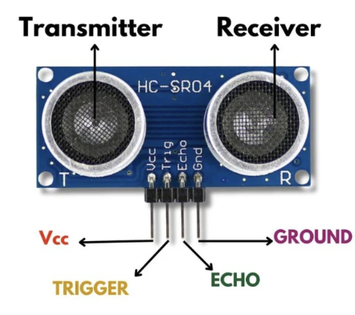
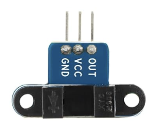
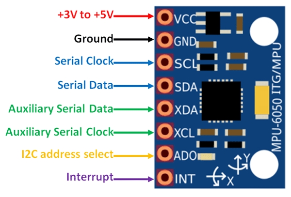
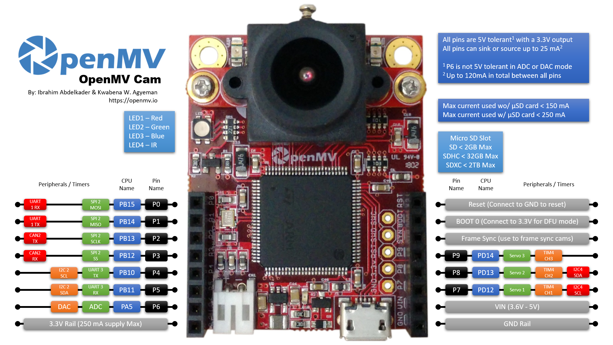
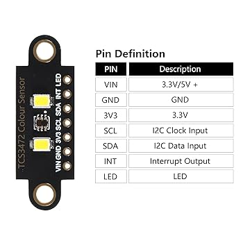
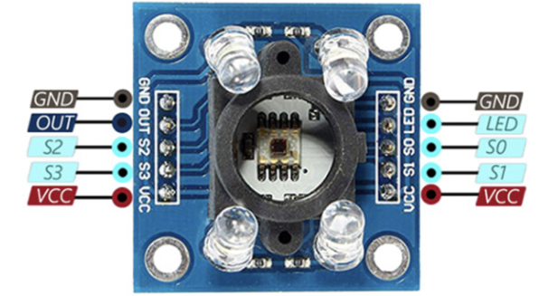
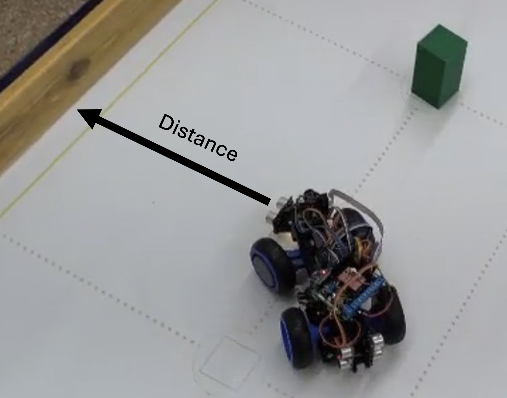
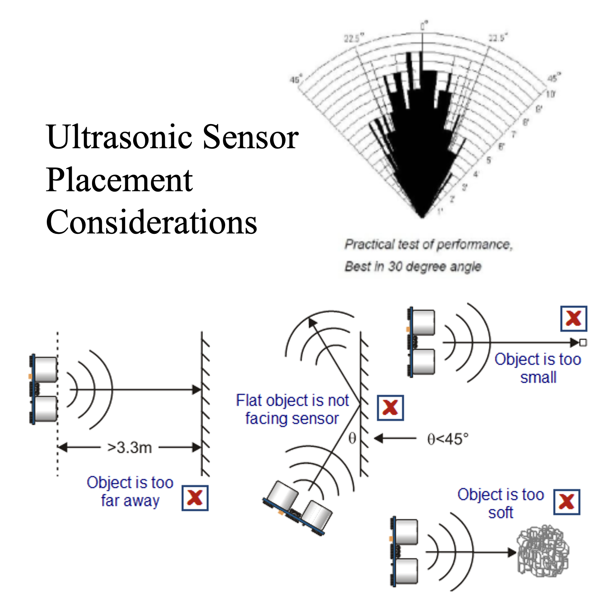
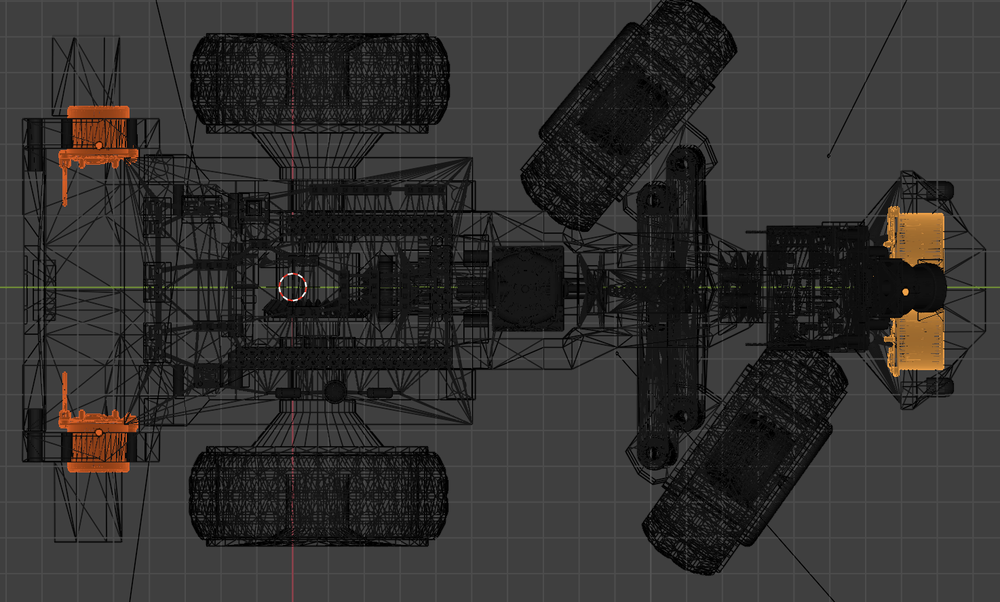
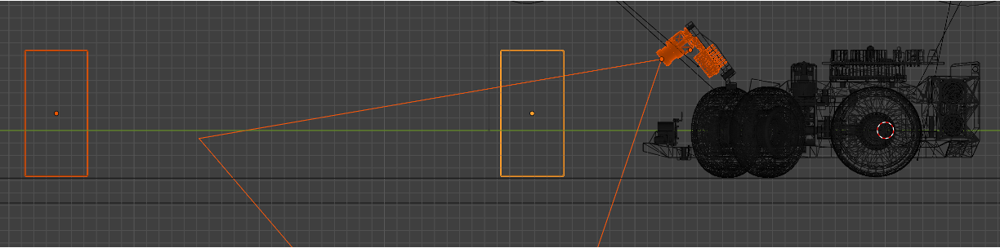

# 4. Sensor and Pin Configurations

This section provides an in-depth look at each sensor integrated into our robot, its specific role within the robot's control system, and its precise pin configuration on the Arduino MEGA 2560 pro.

## 4.1 Overview of Pin Configuration

The following table summarizes the primary pin assignments for all the components on the Arduino Mega 2560 Pro:

| Component                    | Arduino Pin (Digital/Analog) | Function                                       |
| :--------------------------- | :--------------------------- | :--------------------------------------------- |
| IR Encoder                   | `D2`                         | Encoder OUT signal                  |
| DC Motor Driver (MX1508)     | `D4`, `D5`                   | IN1, IN2 (for motor control)        |
| Servo Motor (SG90)           | `D6`                         | Servo control signal                |
| Ultrasonic Front             | `D7` (Trigger), `D9` (Echo) | Distance measurement                |
| Ultrasonic Left              | `D15` (Trigger), `D17` (Echo) | Distance measurement                 |
| Ultrasonic Right             | `D11` (Trigger), `D13` (Echo) | Distance measurement                |
| PixyCam 2.1 (REMOVED)                   | SPI Interface (Default)      | Communication (MISO, 5V, SCLK, MOSI, RESET, GND) |
| OpenMV H7 Plus                  | UART Interface (RX1: `D19` TX1: `D18`)  | Communication (TX, RX, 5V, GND) |
| MPU6050                      | I2C (SDA: `D20`, SCL: `D21`) | Accelerometer + Gyroscope data |
| Bottom Color Sensor (I2C)    | I2C (SDA: `D20`, SCL: `D21`) | Floor color recognition        |
| Left Color Sensor (TCS3200) (REMOVED) | `D51`, `D49`, `D50`, `D52` (S0, S1, S2, S3), `D48` (OUT) | Side color recognition used in our past prototype         |
| Right Color Sensor (TCS3200) (REMOVED) | `D10`, `D8`, `D16`, `D14` (S0, S1, S2, S3), `D18` (OUT) | Side color recognition used in our past prototype          |
| Pushbutton                   | `D3`                         | Start program trigger              |
| LED Indicator                | `D23`                        | Program readiness signal           |
| LED Headlights                | `D8`                        | Lighting for OpenMV H7 Plus         |

**For the circuit design and electromechanical diagram:**

* [General Electromechanical Diagram](../schemes/)
* [Circuit Design (Cirkit)](https://vd-wro.github.io/VD26/embeds/interactive_circuit)
* [KiCad Files](../src/kicad_pcb)

## 4.2 Detailed Sensor Information and Pin Configuration

### Ultrasonic Sensors (HC-SR04)

* **Functionality:** Operates on echolocation principles, emitting an ultrasonic pulse and measuring the time for its return echo to calculate distance. Used for obstacle avoidance.
* **Role:** Three sensors are strategically placed:
  * **Front Ultrasonic Sensor:** Primary for detecting short distances to the wall during turns in the **Obstacle Challenge Round**. This helps execute the predefined turning maneuver.
  * **Left & Right:** Used to adjust the robot's position parallel to the walls, correcting MPU6050 large offsets after laps. More details in [Sensor Placement Logic](#43-sensor-placement-logic)
* **Pin Configuration:**
  * `VCC`: Connected to Arduino `5V`.
  * `GND`: Connected to Arduino `GND`.
  * `TRIG` & `ECHO`: Connected to specific digital/analog pins as per the summary table.
* **Library:** Utilizes the `NewPing` library for efficient sensor management.

### Infrared Optocoupler Encoder

* **Functionality:** Detects pulses generated by the encoding wheel as an interrupt on the Arduino. Essential for accurate odometry (distance and speed measurement).
* **Pin Configuration:**
  * `OUT`: Connected to Arduino Mega `D2` (configured with `attachInterrupt` for `RISING` edge detection).
  * `VCC`: Connected to Arduino `5V`.
  * `GND`: Connected to Arduino `GND`.
* **Key Parameters:** Pulses per revolution (PPR) is `16.0`. Wheel circumference is `22.0` cm.

For the main documentation on **Encoder and Mobility:**
[**Robot Mobility Functionality**](./05_robot_mobility.md)

### MPU6050 Accelerometer + Gyroscope

* **Functionality:** A 3-axis Inertial Measurement Unit (IMU) that provides linear acceleration (accelerometer) and angular velocity (gyroscope) data. The gyroscope's Z-axis (yaw) readings are used for detecting and correcting rotational drift.
* **Role:** Provides continuous orientation data, which is fundamental input for the PID control loop used to correct unwanted rotational drift and maintain a stable heading.
* **Pin Configuration:** Communicates via I2C protocol.
  * `VCC`: Connected to Arduino `5V`.
  * `GND`: Connected to Arduino `GND`.
  * `SCL`: Connected to Arduino Mega `D21`.
  * `SDA`: Connected to Arduino Mega `D20`.
* **Library:** Utilizes the `Adafruit_MPU6050` and `Adafruit_Sensor` libraries.

For the main documentation on **MPU Gyroscope and PID Control:**
[**PID Control for the Gyroscope**](./06_pid_gyroscope_control.md)

### Artificial Vision

* **Functionality:** A fast vision sensor that performs on-board image processing to detect objects based on pre-trained color signatures. It reports object data (x, y position, width, height) to the microcontroller.
* **Role:** Key for vision-based obstacle evasion. Detects red objects to initiate evasion to the right, and green objects to evade to the left.

#### PixyCam 2.1 (Removed in ViZio IV)

* **Pin Configuration:** Communicates via SPI interface (default).
  * `MISO`, `5V`, `SCLK`, `MOSI`, `RESET`, `GND`: Connected to the PixyCam 2.1 ISCP.
* **Library:** Utilizes the `Pixy2` library for integration.

### OpenMV H7 Plus

* **Pin Configuration:** Communicates via UART interface (Serial1, UART3).
  * `GND`, `5V`, `TX`, `RX`: Connected to the OpenMV H7 Plus UART.
* **Library:** Does not require a specific library to function.

Main documentation [**Computer Vision Functions**](07_computer_vision.md).

### Color Sensors (TCS3472 & TCS3200)

* **Functionality:** These sensors detect the color of a surface by measuring the intensity of reflected light across different color filters (Red, Green, Blue).
* **Role:**
  * **TCS3472 (Bottom):** Placed at the robot's base to detect *blue* and *orange* lines on the mat, signaling specific turning points.
  * **TCS3200 (Sides) (Removed):** Two sensors located on the sides. Their primary role was for detecting a *magenta* signal for the final parking maneuver.
* **Pin Configuration (TCS3472 - I2C):**
  * `VCC`, `GND`: Connected to Arduino `5V` and `GND` respectively.
  * `SCL`, `SDA`: Connected to Arduino Mega `D21` and `D20` respectively (I2C bus).
  
  

* **Pin Configuration (TCS3200 - Side Sensors)(Removed):**
  * `VCC`, `GND`: Connected to Arduino `5V` and `GND`.
  * `S0`, `S1`, `S2`, `S3`, `OUT`, `LED`: Connected to specific digital pins as per the summary table.
* **Library:** Utilizes `Adafruit_TCS34725` for the I2C color sensor.

  

For the main documentation on **Color Sensors and Calibration:**
[**Color Detection Functions**](./09_color_detection.md)

## 4.3 Sensor Placement Logic

The following information details how sensors are strategically positioned for optimal operation of each function of the robot.

### Ultrasonic Sensors 

Front ultrasonic sensors were once placed in 45 degree angles from the center to detect walls when the robot was evading an obstacle, as shown in the following figure.

This placement caused problems for front distance measurement; ultrasonic sensors have a limited working angle and these specific distances were no longer needed. 

Ultrasonic sensors are now positioned in the front and sideways for specific tasks (Red = sideways, Yellow = Front), more information in [05 Robot Mobility](../docs/05_robot_mobility.md).

### PCB Circuit

All small modules, including drivers, gyroscopes, were placed onto the PCB for better organization and compactness, we highly suggest to visit [PCB Circuit](02_hardware_components.md#28-circuit-design).

### Camera Pitch Angle

The Camera pitch angle can be customized to improve system coordination, taking into consideration factors such as steering angle, camera FOV (field of view), lighting conditions, lens distortion (wrap), and other factors. We chose 35° as it worked the best for the robot's specifications, it also avoided detecting far obstacles and other objects outside the field. The following illustration highlights the focused object being detected, while the 2nd block is not withing the camera's view.

---

[Back to Main README.md Index](../README.md)
