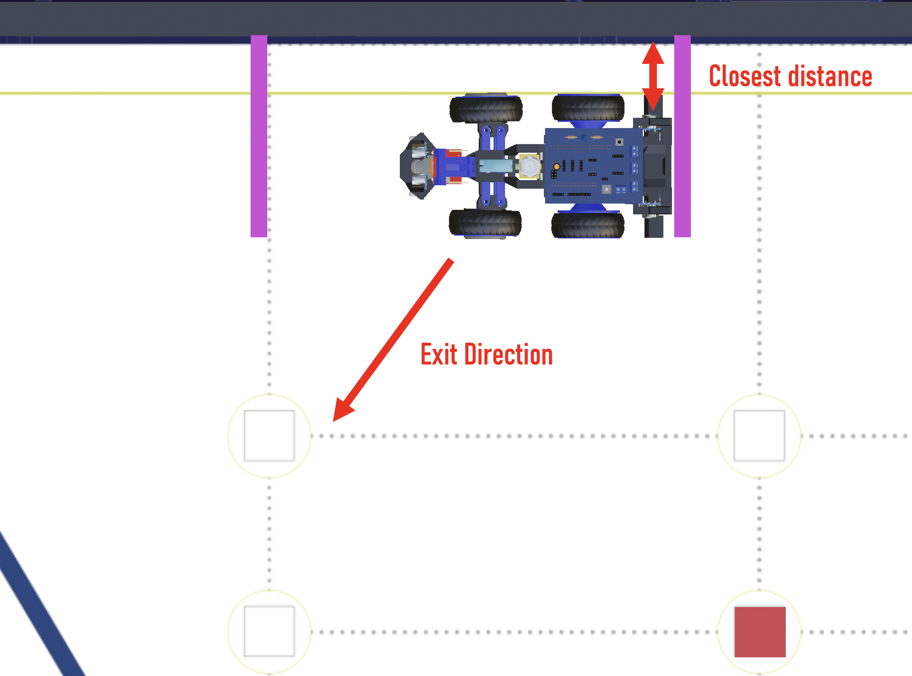
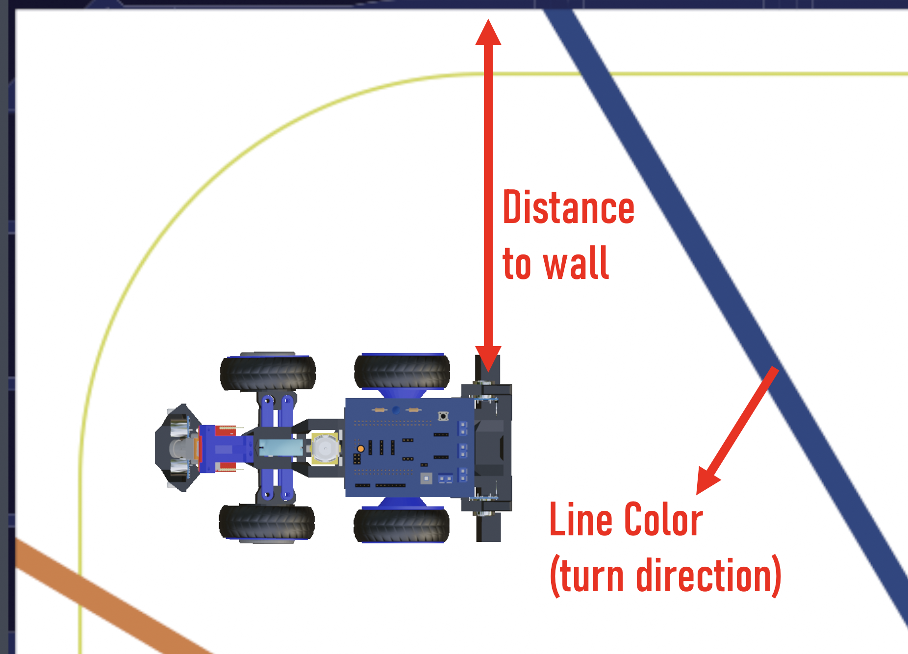
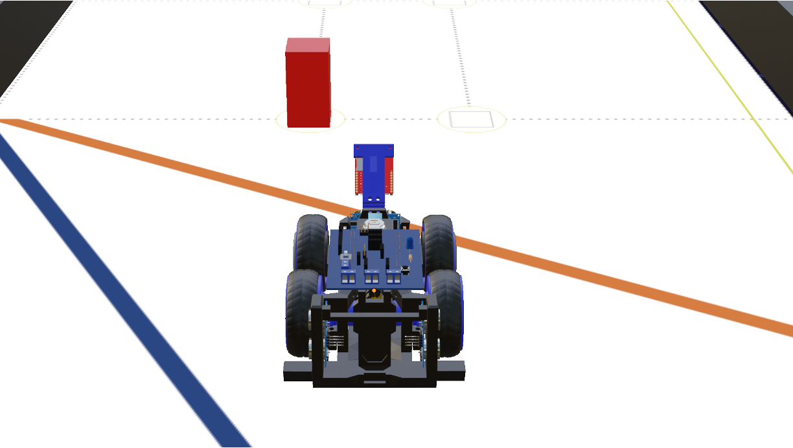
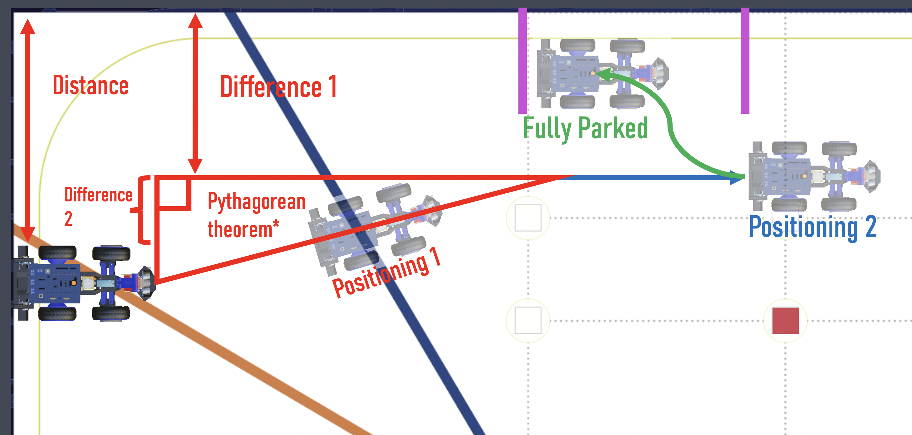
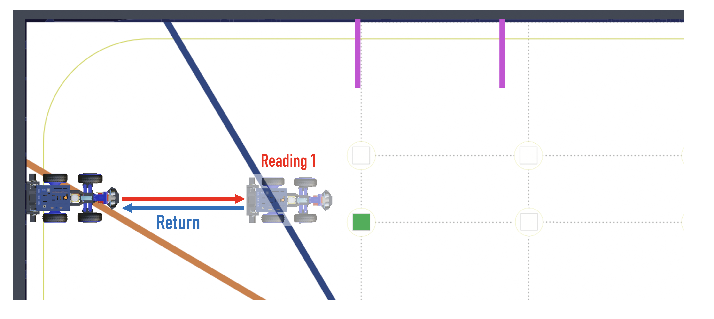
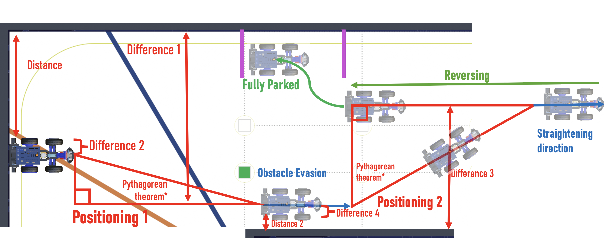

# 5. Robot Mobility

This section provides an in-depth analysis of VizDrive's mobility system, covering mechanical design considerations, motor and steering configurations, and the software module responsible for locomotion.

---

## 5.1 Software Mobility Module

The `movement` module contains the core functions that govern VizDrive's locomotion, abstracting motor and steering control.

### Hardware Definitions

The following preprocessor definitions specify the Arduino pins connected to the motor driver, servo, and encoder:

```cpp
#define MOTOR_INA_PWM 4 // PWM pin for motor INA (DC Motor Driver)
#define MOTOR_INB_PWM 5 // PWM pin for motor INB (DC Motor Driver)
#define SERVO_PIN 6     // Pin for the steering servo motor
#define ENCODER_PIN 2   // Digital pin for the quadrature encoder interrupt
```

### Global Variables and Constants

* **`motorSpeed`**: `const int motorSpeed = 150;` (Defined in `main.ino`) - The default PWM value (0-255) for consistent motor speed during standard operations.
* **`steeringServo`**: `Servo steeringServo;` - The object representing the steering servo motor.
* **`encoderPulseCount`**: `volatile unsigned long encoderPulseCount = 0;` - A volatile counter that increments with each pulse from the encoder wheel, tracking distance traveled.

### Steering Angle Constants

These constants define the safe operational range for the steering servo:

```cpp
const int SERVO_STRAIGHT = 85; // Servo angle for straight-ahead motion
const int SERVO_MAX = 35;      // Maximum angular deflection from SERVO_STRAIGHT (maximum steering angle is 45 degrees)
const int SERVO_LEFT = SERVO_STRAIGHT - SERVO_MAX; // Minimum servo angle for extreme left turn (e.g., 50 degrees)
const int SERVO_RIGHT = SERVO_STRAIGHT + SERVO_MAX; // Maximum servo angle for extreme right turn (e.g., 120 degrees)
```

### Functions

#### `void driveForward(int speed)`

* **Purpose**: Engages the rear DC motors for forward propulsion.
* **Parameters**:
  * `speed`: An integer PWM value (0-255) that directly controls the motor's power and speed.
* **Operation**:
  * `analogWrite(MOTOR_INA_PWM, speed);`: Applies the specified PWM signal to control motor power.
  * `digitalWrite(MOTOR_INB_PWM, LOW);`: Sets the direction pin to `LOW` for forward movement.

#### `void driveBackward(int speed)`

* **Purpose**: Activates the rear DC motors to move the robot in reverse.
* **Parameters**:
  * `speed`: An integer PWM value (0-255) for backward motor power.
* **Operation**:
  * `analogWrite(MOTOR_INA_PWM, LOW);`: Sets the INA pin to `LOW`.
  * `digitalWrite(MOTOR_INB_PWM, speed);`: Applies the PWM signal to the INB pin, establishing the backward direction. This function is specifically utilized for controlled reverse maneuvers, such as during the parking sequence.

#### `void stopMotors()`

* **Purpose**: Deactivates the DC motors, allowing the robot to decelerate naturally.
* **Operation**:
  * `digitalWrite(MOTOR_INA_PWM, LOW);`
  * `digitalWrite(MOTOR_INB_PWM, LOW);`
        This method provides a gentle stop, reducing mechanical stress compared to an abrupt brake.

#### `void stopBrake()`

* **Purpose**: Implements an immediate and forceful braking action for the DC motors.
* **Operation**:
  * `digitalWrite(MOTOR_INA_PWM, HIGH);`
  * `digitalWrite(MOTOR_INB_PWM, HIGH);`
        By setting both motor input pins to `HIGH`, a short-circuit braking effect is achieved, resulting in a rapid stop. This is typically used for emergency halts or final system shutdown.

#### `void setSteeringAngle(int angle)`

* **Purpose**: Controls the angular position of the front steering wheels using the attached servo motor.
* **Parameters**:
  * `angle`: An integer representing the desired servo position in degrees (0-180).
* **Operation**:
  * `steeringServo.write(angle);`: Sends the `angle` command to the servo using the `Servo.h` library.
  * `angle = constrain(angle, SERVO_LEFT, SERVO_RIGHT);`: The `angle` value is constrained to remain within `SERVO_LEFT` and `SERVO_RIGHT` boundaries.
* **Safety**: It is important to constrain the angle into the maximum boundaries. This prevents over-rotation and physical interference with the chassis.

#### `void exitParking()`

* **Purpose**: Exits the parking zone by steering away from nearby walls based on real-time distance readings from ultrasonic sensors.
* **Operation**:
  1. **Distance Measurement**:
     ```cpp
     int distanceR = getDistance(sonarRight);
     int distanceL = getDistance(sonarLeft);
     ```
     The function begins by measuring the distance to the nearest  wall using the right and left ultrasonic sensors. These values are filtered by the `getDistance()` function to ensure stability and reduce noise.
     
  3. **Decision Logic Based on Proximity**:
     The robot determines which side is closer to a wall and selects an appropriate evasive maneuver:
     
     * **Wall on the Right**:

       ```cpp
       if (distanceR < 30 && distanceR != 0) {
           steeringServo.write(SERVO_STRAIGHT - 40);
           driveForward(220);
           safeDelay(1000);
       }
       ```
       If the right wall is within 30 cm and the reading is valid (not zero), the robot steers sharply to the **left** (by subtracting 40 from the straight angle) and drives forward at a moderate speed. The movement is sustained for 1000 milliseconds using a non-blocking `safeDelay()` to allow for orientation updates.

     * **Wall on the Left**:

       ```cpp
       else if (distanceL < 30 && distanceL != 0) {
           steeringServo.write(SERVO_STRAIGHT + 40);
           driveForward(220);
           safeDelay(1000);
       }
       ```
       
     Similarly, if the left wall is within 30 cm, the robot steers sharply to the **right** (adding 40 to the straight angle) and drives forward with the same parameters.

     * If neither wall is detected within the 30 cm threshold, the robot assumes it is centered and skips the exit parking maneuver entirely.

#### `void parkingManeuver()`

* **Purpose**: Executes a predefined parking maneuver, adapting to the robot's current turning `direction`.

* **Operation**:

    1. **Defining Math and Control Variables**

        ```cpp
        int distance = getDistance(sonarLeft); // The distance to the wall
        // Pythagorean theorem
        int a_cm = distance - 28; // a_cm is negative if the bot is too near to the wall
        int b_cm = 75; // Longitudinal distance
        int c_cm; // Diagonal distance
        int angle; // Angle of turn
        int turnDirection; // Used to know the direction of the turn; if a_cm is 0, this variable is 0 (no turn is required)
        ```
        Variables are changed according to the parking maneuver to be executed, which depends on the `direction`.

        The diagonal distance `c_cm` and the `angle` required to get near the parking lot is calculated using geometric concepts and trigonometry. 

    2. **Defining Turn Direction**

        ```cpp
        if  (a_cm > 0) { // Close to wall
          c_cm = sqrt(pow(a_cm, 2) + pow(b_cm, 2)); // Calculates the amount of pulses for diagonal movement
          turnDirection = 1;
        }
        else if (a_cm < 0){ // Far from wall
          c_cm = sqrt(pow(a_cm, 2) + pow(b_cm, 2)); // Calculates the amount of pulses for diagonal movement
          turnDirection = -1;
        } else { 
          c_cm = b_cm; // No amount of diagonal movement
          turnDirection = 0;
        }
        ```
        The `turnDirection` variable defines the orientation of the turn. If the robot is near the wall, it will proceed to turn outwards; conversely, if it's far from the parking, it will turn inwards. Moreover, there is a possibility `a_cm = 0`. For this case, no turn is required, indicating that `turnDirection` will be null.

    3. **Calculating Turn**

        ```cpp
        if (turnDirection != 0) { // Diagonal movement is required
          float tangent = ((float)abs(a_cm)/b_cm); // Calculate tangent
          angle = (int)(atan(tangent) * (180.0 / M_PI)); // Calculate required turn angle

          turnTargetYaw = (turnTargetYaw + (angle*direction*turnDirection)); // Adjustes target yaw
          setTargetYaw(turnTargetYaw); 
        } else { // No angle was required
          Serial.print(" - No angle required - ");
        }
        ```
        The required angle is calculated and applied to the target yaw.

    4. **Movement Execution**

        ```cpp
        encoderDelayOrientation(c_cm); // Waits until the defined distance is complete
        stopBrake();  // Stops the motors

        if (turnDirection != 0) { // Resets angles when distance is complete
          turnTargetYaw = (turnTargetYaw - (angle*direction*turnDirection));  // Resets the target yaw
          setTargetYaw(turnTargetYaw); // Applies the target yaw
        }
        ```

        The movement is executed, and the target yaw is reset, positioning the robot past the parking lot, aligned parallel to the outer wall.

    5. **Parking Sequence**: The robot moves backwards, the steering servo is turned to the direction of the parking, it reverses and steers to the opposite direction, calculating the amount of steps using `encoderDelay()`, completing the parking maneuver.

* **Adapted Parking Maneuver**: 

    1. **Block Detection**

        ```cpp
        bool parkingManeuverBlockDetection() {
          driveForward(parkingSpeed);
          encoderDelayOrientation(55); // advanced 5 cm.;

          stopBrake();
          delay(1000);
          readBlock(); // reads the blocks detected by the OpenMV camera

          if (!obstacleDetected()) {
            return false; // If no blocks detected, just false.
          }

          int blockSignature = currentColor;
          
          if (direction == +1 && blockSignature == SIGNATURE_RED) {
            return true;
          } else if (direction == -1 && blockSignature == SIGNATURE_GREEN) {
            return true;
          } else return false;
        }
        ```

        It first drives forward to detect and determine the few possible cases available: no block, red block or green block. After this detection, the robot will then proceed to execute the parking maneuver after reversing to its initial position. If the robot has to proceed to the outer wall to park, the same parking maneuver will be executed; however, if the robot has to proceed to the inner wall to evade an obstacle, the following steps are taken.

    2. **Obstacle Evasion**

        ```cpp
        int distance = getDistance(sonarLeft);
        int a_cm = (distance - 75);
        int b_cm = 75;
        int c_cm;
        int angle;
        int turnDirection;
        ```

        Triangle values are changed, as shown in the code block above. Turn direction is also changed, for the opposite direction must be taken in this maneuver. The same positioning algorithm is used.

        ```cpp
        driveForward(parkingSpeed);

        encoderDelayOrientation(39); // Waits until the defined distance is complete
        stopBrake();  // Stops the motors

        setSteeringAngle(SERVO_STRAIGHT); // Resets Servo Angle
        ```

        The robot now proceeds to drive foward to align itself parallelly to the walls.

    3. **Positioning Execution**

        ```cpp
        //Overwriting math variables
        distance = getDistance(sonarRight);
        a_cm = (distance - 57);
        b_cm = 75;
        c_cm;
        angle;
        turnDirection;
        ```

        The same positioning function is used, except the ultrasonic sensor used is swapped to the one located in opposite direction, since its closer to this wall, errors are less likely to happen.
      
    4. **Parking Maneuver Sequence**

        The robot now proceeds to execute the standard parking coreography, advancing to align itself, then driving backwards and steering to park itself in the designated area. For a graphic representation of this maneuver, please refer to [adapted parking maneuver](#adapted-parking-maneuver).

For a visual explanation of the robot's parking system's [parking maneuver](#parking-maneuver).


#### `void encoderISR()`

* **Purpose**: This is an Interrupt Service Routine (ISR) designed to detect pulses from the quadrature encoder attached to the drivetrain.
* **Operation**:
  * `encoderPulseCount++;`: Increments the `encoderPulseCount` variable every time a rising edge is detected on the `ENCODER_PIN`. This ISR is attached to the hardware interrupt for `ENCODER_PIN`, ensuring highly accurate pulse counting for distance measurement.

## 5.2 Driving Algorithm

This portion details the steps of ViZio's driving steps, logic, and order in a visual way, which is executed after initializing and calibrating all sensors and systems. This encases and unifies software architecture functions, which correspond to logic and mathematics, robot mobility, responsible for robot actuation and movement. Since this repository has no reading hierarchy, we highly recommend reading the other documents that explain the specific functions thoroughly. [PID Gyroscope Control](./06_pid_gyroscope_control.md), [Computer Vision](./07_computer_vision.md), [Ultrasonic Distance Sensing](./08_ultrasonic_distance_sensing.md), and [Color Detection](./09_color_detection.md).

### Parking exit

Executes the parking exit [`void exitParking()`](#void-exitparking). To determine parking exit direction, it utilizes the side ultrasonic sensors to determine the [closest distance](03_software_architecture#distance-detection), it then proceeds to exit to the opposite direction.



### Drive and Orientation

After executing parking exit, the robot enables constant motor drive [`void driveForward(int speed)`](#void-drivebackwardint-speed), and [keeps orientation](06_pid_gyroscope_control.md#void-keeporientation) (drives in a straight path).

### Turning Maneuver

Depending on the [floor color detected](03_software_architecture.md#color-detection), the robot will assign the correct ultrasonic sensor used to measure the distance to the wall to then select the [appropriate maneuver](09_color_detection.md#93-turn-maneuver-logic-void-handlecoloraction) with the space available.



### Obstacle Evasion

When [encountering an obstacle](03_software_architecture.md#artificial-vision-obstacle-evasion), the robot will proceed to execute an obstacle [evasion maneuver](07_computer_vision.md#73-obstacle-evasion-logic-void-handleevasion) depending on the obstacle color.



### Parking Maneuver

The robot will now proceed to calculate the correct [parking maneuver](#void-parkingmaneuver) depending on its exact position.

||||
|--|--|--|
|**Positioning 1**||Maneuvers the robot to the appropriate distance to the wall.|
||Distance|Distance from the ultrasonic sensor to the wall.|
||Difference 1|Ideal distance from the center of the robot to the wall.|
||Difference 2|Distance from the ultrasonic sensor to the ideal position of the robot.|
|**Positioning 2**||The robot drives forward to align into a straight trajectory after the turn.|
|**Fully Parked**||The robot parks driving backwards.|



But, during WRO, after many discussions with the judges, we realized our parking maneuver was incomplete. Coincidentally, we had never received a color block in the sides of the mat, so our parking logic did not consider that this block would need to be avoided too. It would ignore the block, cross it from the left side independently of the color, and just execute the parallel parking. We had to now adapt our code a night before the challenge rounds to avoid this block for our full score to be accepted...

### Adapted Parking Maneuver

#### Block Detection

Before starting the parking maneuver, the robot advances slightly to detect if a block is present before entering the section. It would then return to its starting point to initiate the parking maneuver.



#### Case 1: No block detected/evade toward parking direction (left, using the figure as reference)

It would proceed to perform the already explained [parking maneuver](#parking-maneuver).

#### Case 2: Evade to the opposite direction (right, using the figure as reference)



||||
|--|--|--|
|**Positioning 1**||Maneuvers the robot to the appropriate distance to the wall to evade the obstacle.|
||Distance|Distance from the ultrasonic sensor to the wall.|
||Difference 1|Ideal distance from the center of the robot to the wall.|
||Difference 2|Distance from the ultrasonic sensor to the ideal position of the robot.|
|**Obstacle Evasion**||The robot drives forward, successfully evading the obstacle.|
|**Positioning 2**||Maneuvers the robot to the appropriate distance to the wall to park.|
||Distance 2|Distance from the ultrasonic sensor to the wall.|
||Difference 3|Ideal distance from the center of the robot to the wall.|
||Difference 4|Distance from the ultrasonic sensor to the ideal position of the robot.|
|**Straightening direction**||A small foward movement to align the robot parallel to the wall.|
|**Reversing**||The drives backwards, positioning itself beside the parking area.|
|**Fully Parked**||The robot parks driving backwards.|


## 5.3 Mechanical Differential

This gear system divides motor torque and allows the drive wheels on the same axle to rotate at different speeds when turning. This functionality is essential for preventing tire wear, skidding, and vehicle dragging.

Consists of:

* **Pinion Gear**: The input, connected directly to the motor. It receives rotational power and transfers it into the differential assembly.

* **Ring Gear**: A larger gear meshed to the pinion gear at 90°. This significantly larger gear utilizes a higher tooth count to reduce rotational speed (RPM) while multiplying output torque.

* **Differential Case**: The central rotating case driven by the ring gear. Its objective is to protect the internal gears.  

  * **Spider Gears**: Small gears mounted on a shaft inside the spinning differential case. They operate with a dual-motion versatility: capable of revolving collectively with the case or spin independently on their own axes.

  * **Side Gears**: Two gears positioned on either side of the spider gears, splined directly to the inner ends of the left and right axle shafts. They receive power from the spider gears to turn the wheels.

The power flows in a specific sequence:
**Motor** &rarr; **Pinion** &rarr; **Ring Gear** &rarr; **Differential Housing** &rarr; **Spider Gears** &rarr; **Side Gears** &rarr; **Wheels**.

### Principal Core

The entire mechanism functions based on the resistance encountered by the wheels.

#### Straight-Line Driving

When the vehicle moves straight ahead, both wheels experience the same amount of resistance from the road.

* The input pinion turns the ring gear, spinning the differential case.
* Since the resistance on both side of the gears is identical, the internal spider gears do not spin on their own shafts. They turn along with the case, not causing any resistance.
* As a consequence, both axles spin at the exact same speed as the ring gear.

#### Cornering Dynamics

Basic geometry tells us that when turning, the inner wheel travels a shorter path, experiencing more resistance, skidding, and forcing it to slow down.

* The inside axle slows down, causing the attached gear to slow down too.
* The differential case is still being spun at a constant speed by the ring gear, but the inside axle is at a different speed. This speed forces the spider gears to begin spinning on their own internal shafts. Their rotation relative to the differential case is slower.
* This spinning motion automatically transfers the lost speed directly to the outside side gear, causing the outside wheel to spin faster by the exact same amount the inside wheel slowed down.

---

[Back to Main README.md Index](./../README.md)
