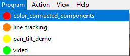
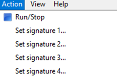
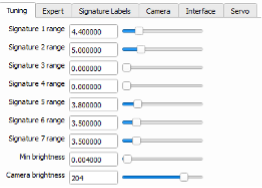
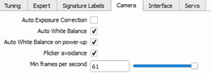
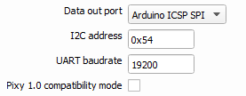
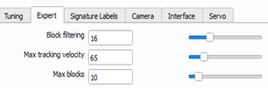
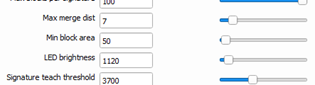
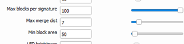
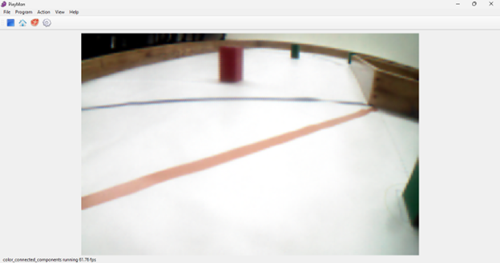
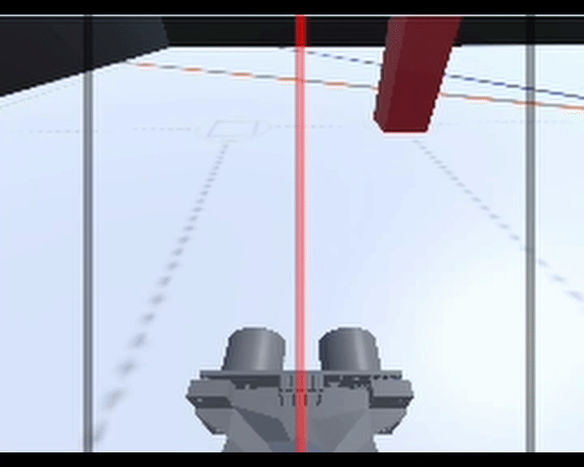

# 7. Vision and Distance Sensing

VizDrive now utilizes the OpenMV H7 Plus to detect and react to obstacles in real time.

---

## 7.1 OpenMV H7 Plus (NEW!)
The **OpenMV Cam** is a small, low power, microcontroller board uses machine vision in the real-world. For this instance, we are using blob based color detection, using LAB color space.

### Camera Configuration

Overview of the camera's setup and code.

#### Sensor and System Initialization

All required libraries are imported, serial communication to the Mega is established through `UART3` (OpenMV) and `SERIAL1` (Mega). LEDs in the camera are defined, for they are used as block detection indicators for easier debugging. Pixel format and frame size are set up for optimal LAB blob detection.

```py
# ===== OpenMV Color Tracking Script =====

# import required libraries and modules for hardware interfacing, image processing, and timing
from pyb import UART, LED 
import sensor, image, time

# Initialize serial communication (UART)
# UART 3 at 115200 bps for communication.
uart = UART(3, 115200)

# Initialize on-board status indicators
red_led = LED(1)
green_led = LED(2)

# Reset and initialize the camera sensor hardware
sensor.reset()

# Configure pixel format to RGB565 (16-bit per pixel, Red-Green-Blue)
sensor.set_pixformat(sensor.RGB565)

# Configure frame size to QQVGA (Quarter Quarter Video Graphics Array: 160x120 pixels)
sensor.set_framesize(sensor.QQVGA)

# Disable Automatic Gain Control (AGC) to ensure deterministic color evaluation
sensor.set_auto_gain(False)

# Disable Automatic White Balance (AWB) and lock precise digital RGB gains 
# to maintain color consistency across variable environmental illumination
sensor.set_auto_whitebal(False, rgb_gain_db=[62.0, 60.0, 62.0])

# Disable Automatic Exposure Control (AEC) and set static exposure to 25,000 microseconds
sensor.set_auto_exposure(False, exposure_us=25000)

# Allow sensor clock and automatic adjustments to stabilize over a 2000ms window
sensor.skip_frames(time=2000)

# Initialize the frame rate tracking clock
clock = time.clock()
```

Functions like AWB (auto-white-balance), auto-gain, and auto-exposure are disabled to maintain stable lighting during the whole trajectory. Start-up AWB gain overwrite and auto-gain coefficients are configured to a specific value, attempting to achieve similar conditions every time the camera boots; it is not possible to initialize the camera without a start-up AWB, gain, and exposure. For this white balance configuration specifically, red and blue gains are incremented, it balances out the initial start-up AWB. This balance is required since the robot starts with the magenta wall in front, and it is necessary to boost these values to achieve a clean white balance.

#### Color Detection Functions and Initialization

Main color thresholds are established for red and green blobs using LAB color space. Even though magenta contains slightly more blue than red, it is still a minimal difference to distinguish the parking lot from the red obstacles, so, for red specifically, an additional hue factor was included into the filtering to verify it is true red, and not magenta.

```py
# COLOR THRESHOLDS (CIE L*a*b* COLOR SPACE)
# Red Threshold:
red_threshold = (0, 100, 17, 127, 21, 127)
# Hue boundaries for red chrominance validation
RED_H_MIN = 0
RED_H_MAX = 15

# Green Threshold:
green_threshold = (0, 91, -128, -12, -35, 49)

# Validates whether a detected blob conforms to true red chrominance criteria by converting its centroid pixel to the HSV color space.
def is_true_red(img, blob):
    # Sample the RGB values directly from the centroid coordinates of the blob
    r, g, b = img.get_pixel(blob.cx(), blob.cy())

    # Normalize standard 8-bit integer RGB values to floating-point values between 0.0 and 1.0
    r_n, g_n, b_n = r / 255.0, g / 255.0, b / 255.0
    mx = max(r_n, g_n, b_n)
    mn = min(r_n, g_n, b_n)
    df = mx - mn

    # Compute Hue (H) based on the dominant primary color channel
    if mx == mn:
        h = 0
    elif mx == r_n:
        h = (60 * ((g_n - b_n) / df) + 360) % 360
    elif mx == g_n:
        h = (60 * ((b_n - r_n) / df) + 120) % 360
    elif mx == b_n:
        h = (60 * ((r_n - g_n) / df) + 240) % 360

    # Downscale the standard 360-degree Hue circle to an 8-bit compliant 0-179 range
    h_scaled = int(h / 2) 

    # Evaluate the scaled hue against the predefined upper boundary constraint
    return (h_scaled <= RED_H_MAX)
```

#### Blob Detection and Y-Bound Filter

This is the main loop, it reads the sensor information and runs two separate blob detection functions, this is due to the limitations of a single function performing two readings at the same time: if both blobs are together, or overlap, none are returned from the function, so the two-function approach was chosen. The only difference between the red and green function is in the hue factor, which is only applied to the red blob detection function. For all blobs inside the sensor frame, only the ones inside the Y-bound ROI are taken into consideration, and elected as **candidates**.

```py
while True:
    # Update internal frame rate monitor clock
    clock.tick()
    
    # Capture the latest image frame from the sensor
    img = sensor.snapshot()

    # Isolate pixel clusters aligning with defined red and green color matrices
    red_blobs = img.find_blobs([red_threshold], pixels_threshold=100, area_threshold=100)
    green_blobs = img.find_blobs([green_threshold], pixels_threshold=100, area_threshold=100)

    # Initialize list to filter and collect candidate targets
    candidates = []

    # Process and filter detected red blobs
    for blob in red_blobs:
        # Enforce Hue validation and structural spatial filtering (excluding the upper horizon)
        if (is_true_red(img, blob) and blob.cy() > (119 / 6)):
            candidates.append(("2", blob)) 
            
        # Protocol key "2" designates a validated red target

    # Process and filter detected green blobs
    for blob in green_blobs:
        # Enforce spatial filtering based on the horizon threshold
        if blob.cy() > (119 / 6):
            candidates.append(("1", blob))  # Protocol key "1" designates a validated green target

    # Default State: Ensure status indicators are darkened prior to target processing
    red_led.off()
    green_led.off()   
```

#### Size Filtering and Data Transmission

This function is inside the main loop, and it filters out the prevously elected candidates, keeping only the one with the largest area. After the final blob is elected, the message is constructed, consisting of 3 values: signature number, X-position, and Y-position. `(color, cx, cy)` and proceeds to send the message of the classified block through UART Serial communication.

```py
    # Process localized candidates if any have passed primary filtering criteria
    if len(candidates) > 0:

        # Select the dominant target based on the maximum pixel area metric
        color, blob = max(candidates, key=lambda item: item[1].pixels())

        # Extract structural bounding dimensions and centroid coordinates
        x, y, w, h = blob.rect()
        cx, cy = blob.cx(), blob.cy()

        # Target Specific Processing: Red Classification
        if color == "2":
            # Render descriptive user interface graphics on the image buffer
            img.draw_rectangle(blob.rect(), color=(255, 0, 0))
            img.draw_cross(cx, cy, color=(255, 0, 0))
            img.draw_string(x, y, "RED", color=(255, 0, 0))

            # Actuate corresponding hardware visual feedback indicators
            red_led.on()
            green_led.off()

        # Target Specific Processing: Green Classification
        else:
            # Render descriptive user interface graphics on the image buffer
            img.draw_rectangle(blob.rect(), color=(0, 255, 0))
            img.draw_cross(cx, cy, color=(0, 255, 0))
            img.draw_string(x, y, "GREEN", color=(0, 255, 0))

            # Actuate corresponding hardware visual feedback indicators
            green_led.on()
            red_led.off()

        # Transmit comma-separated telemetry payload over the serial interface
        uart.write("{},{},{}\n".format(color, cx, cy))
        
    # Output runtime diagnostics to the serial debugging terminal
    print("FPS:", clock.fps())
```

### Main Control Configuration

Overview of the Mega's setup and code.

#### Initialization (`void initVision()`)

  * **Purpose**: Establishes serial communication with the OpenMV.
  * **Operation**:
      * `Serial1.begin(115200);`: Initializes serial communication at 115200 baud rate.

```cpp
void initVision() {
  Serial1.begin(115200);
  delay(100);
  Serial.println("Artificial vision initialized...");
}
```

#### Obstacle Detection (`void obstacleDetected()`)

  * **Purpose**: Checks if an obstacle classified to be evaded is available.
  * **Operation**:
      * `return Serial1.available();`: Sends "true" whenever there is data coming from the camera.

```cpp
// Checks if any part of any detected block is within the crucial lower region (below ROI_Y_BOUND).
bool obstacleDetected() {
  return Serial1.available();
}
```

#### Data Retrieval (`void readBlock()`)

  * **Purpose**: Establishes serial communication with the OpenMV.
  * **Operation**:
      * Checks if there is data available `Serial1.available() > 0` and then retrieves the data avaiable `Serial1.readStringUntil('\n')`.
      * Locates the commas that separate the messages data: signature, X-position, and Y-position.
      * Assigns the data to variables containing block information.

```cpp
// Block data variables
int currentColor;
int currentX;
int currentY;

// Reads blocks
bool readBlock() {
  if (Serial1.available() > 0) {
    // Read the string until a newline character
    String data = Serial1.readStringUntil('\n');
    // Find the commas to split the string
    int firstComma = data.indexOf(',');
    int secondComma = data.indexOf(',', firstComma + 1);
    // Assign block data to variables
    if (firstComma != -1 && secondComma != -1) {
      currentColor = data.substring(0, firstComma).toInt();;
      currentX = data.substring(firstComma + 1, secondComma).toInt();
      currentY = data.substring(secondComma + 1).toInt();
    }
    return true;
  }
  else {
    return false;
  }
}
```

#### Serial Flush (`void clearSerial()`)

  * **Purpose**: Flushes out residue data from the serial buffer.
  * **Operation**:
      * Checks if there is data available `Serial1.available() > 0` and then flushes the data in the buffer `Serial1.read();`.

```cpp
void clearSerial() {
  while (Serial1.available() > 0) {
    Serial1.read(); 
  }
  Serial.println("Serial clear");
}
```

---

## 7.2 PixyCam 2.1 for Vision-Based Obstacle Evasion

The **PixyCam 2.1** is an intelligent, compact vision sensor that provides rapid object recognition based on pre-trained color signatures. Its integrated processor significantly offloads computational burden from the main microcontroller, enabling real-time obstacle detection.

### Global Object and Configuration Parameters

```cpp
Pixy2 pixy; // PixyCam 2.1 object for communication and control

#define SIGNATURE_RED 2   // Defined signature ID for red obstacles
#define SIGNATURE_GREEN 1 // Defined signature ID for green obstacles

/* Configuration of the Region of Interest
   Coordinates of the Pixy resolution: width: 316, height: 208 */

// Y-coordinate threshold for an object to be considered "near" and start evasion.
// Any part of the object below this Y-coordinate will trigger detection.
const int ROI_Y_BOUND = 208 / 6;

const int IMAGE_WIDTH = 316;
// Define sections of the image for evasion completion check
const int LEFT_SECTION_END_X = IMAGE_WIDTH / 3;      // X-coordinate separating left third
const int RIGHT_SECTION_START_X = (2 * IMAGE_WIDTH) / 3; // X-coordinate separating right third
```

### Initialization (`void initVision()`)

  * **Purpose**: Establishes communication with and initializes the PixyCam 2.1 module.
  * **Operation**:
      * `pixy.init();`: Calls the initialization function from the `Pixy2` library. This function configures the SPI interface and prepares the camera for block detection.

### Obstacle Detection (`bool obstacleDetected()`)

  * **Purpose**: Determines if any detected colored object ("block") is currently present within the crucial lower region (below `ROI_Y_BOUND`).
  * **Operation**:
    1.  `pixy.ccc.getBlocks();`: Commands the PixyCam to process the current frame and retrieve a list of detected blocks (objects with assigned color signatures).
    2.  `if (pixy.ccc.numBlocks == 0) return false;`: If no blocks are reported by the PixyCam, no obstacles are present, and the function returns `false`.
    3.  **Iterative ROI Check**: The function then iterates through all detected `pixy.ccc.blocks`. For each block:
          * `if (pixy.ccc.blocks[i].m_y + (pixy.ccc.blocks[i].m_height / 2) > ROI_Y_BOUND)`: Checks if the bottom edge of the block extends beyond the `ROI_Y_BOUND`. If an object is found in this range, it is considered an obstacle, and the function immediately returns `true`.
    4.  If the loop completes without identifying any blocks in the crucial lower region, the function returns `false`.

### Debugging Function (`void debugPixy()`)

  * **Purpose**: Provides detailed real-time information about blocks detected by the PixyCam to the Serial Monitor, aiding in calibration and troubleshooting.
  * **Operation**: It iterates through `pixy.ccc.numBlocks` and prints the index, X/Y coordinates, and color signature of each block. It also explicitly indicates whether each block falls within the defined ROI (`LEFT_BOUND` and `RIGHT_BOUND`). This function is typically commented out in the main code for performance optimization but is invaluable during development.

### PixyMon Configuration and Parameters

The PixyCam 2.1 requires initial setup and color signature training via the **PixyMon** software (compatible with Windows, macOS, and Linux). This graphical interface enables precise calibration of color signatures and adjustment of various camera parameters, which are then saved directly to the PixyCam's firmware.

Here are the key configurations applied in PixyMon for obstacle detection:

| Configuration Area | Parameter / Setting          | Value / Description                                                                                                                                                                                                           | Image |
| :----------------- | :--------------------------- | :--------------------------------------------------------------------------------------------------------------------------------------------------------------------------------------------------------------------- | :---------------------------: | 
| **Program** | `File > Set program`         | **`ccc_program`**: This program (Color Connected Components) is selected as it is specifically designed for detecting and tracking color-coded objects. |      |
| **Signatures** | `Action > Set Signature`     | **`Signature 1 (Green)`** and **`Signature 2 (Red)`**: These specific signature IDs are assigned to the green and red obstacles on the competition field. Each signature is 'taught' by drawing a bounding box around the target object in the live video feed. |      |
|                    | `Configure > Signature N`    | **Hue, Saturation, Value (HSV) Ranges**: After teaching, these ranges are meticulously fine-tuned for each signature. The goal is to optimize detection reliability under varying ambient light conditions and to minimize false positives from background colors. |      |
| **Camera** | `Configure > Camera`         | **Brightness**: Adjusted to an optimal level to ensure good image exposure without over-saturation or underexposure.                                                                                                   |      |
|                    | `Configure > Camera`         | **Auto White Balance**: **Enabled (`Auto`)** to allow the camera to automatically adapt to different lighting temperatures on the field, ensuring consistent color interpretation.                                          |      |
|                    | `Configure > Camera`         | **Auto Exposure**: **Enabled (`Auto`)** for automatic adjustment of exposure settings. This is crucial for adapting to dynamically changing light intensities throughout the mission.                                     |      |
|                    | `Configure > Camera`         | **LED Mode**: Set to `Auto` or `On` as needed to ensure proper illumination of detected objects for consistent signature recognition.                                                                                         |      |
| **Interface** | `Configure > Interface`      | **Data Out Port**: Set to **`SPI`** to enable high-speed serial communication with the Arduino Mega.                                                                                                                      |      |
| **Expert** | `Configure > Expert`         | **Max Blocks**: Set to a low value (e.g., `2`) to limit the number of reported blocks, focusing on the most dominant obstacles.                                                                           |      |
|                    | **Min Block Size (Width/Height)** | Configured to filter out very small (and likely distant or noisy) detections, ensuring only relevant obstacles are reported.                                                                                           |      |
|                    | **Merge Blocks** | **Enabled**: This setting is activated to instruct the PixyCam to merge adjacent detections of the same color signature into a single, larger block, improving robustness for objects that might be detected as fragmented. |      |

---



### Pixy Parameters Decalibration

While we were competing in the Nationals, we noticed something: our robot kept failing to properly evade the objects. Every other logic was working, which led us to know that it was the Pixy which was the problem. 
However, we later found an unsolved **bug** in PixyCam's software; tuning parameters such as AWB (Auto White Balance), auto-exposure, and AWB on start-up did not work, this meant that everytime we started the bot, parameters changed. If you are working, this is what we suggest trying to avoid dramatic changes:

* **Method 1 (Room is well-lit and uniform):** Set `Camera Brightness` to 0, Pixycam will now always initiate with the same brigthness value, this means room lighting needs to be appropriate for proper functioning.
* **Method 2 (Room is slightly dark):** Set `Camera Brightness` anywhere between 1-3, choose what works best for the room. Please note there is a drastic change between `Camera Brightness = 0` and `Camera Brightness = 1`, `Camera Brightness = 1` up until `Camera Brightness = 3` are subtle changes. With this method, we highly recommend to start the bot with your finger over the camera lens so that the brightness value is always as consistent as possible.

Besides the mentioned software problem, the combination of a poor camera sensor and poor AWB worsened the camera brightness problem. It was extremely hard to find the right balance between red and green, green being the much darker color, shown as almost black, compared to the excessively bright red objects.

## 7.3 Obstacle Evasion Logic (`void handleEvasion()`)

  * **Purpose**: Manages the robot's steering to actively evade a detected obstacle, continuing until the path is clear.
  * **Operation**:
    ```cpp
    if (!obstacleDetected()) {
      return;
    }
  
    // --- Start of the blocking evasion loop ---
    // Once this point is reached, the car is committed to evading.
    Serial.println("--- EVASION PROTOCOL INITIATED ---");
  
    int activeSignature = 0; // Stores the signature of the obstacle being evaded (1 for red, 2 for green).
  
    // This loop will now run indefinitely until the exit condition is explicitly met.
    while (true) {
      readBlock(); // old function -> pixy.ccc.getBlocks(); // Get the latest block data in every iteration.
      updateOrientation();
      if (detectFloorColor()) {
        handleColorAction();
        break;
      }
    ```

    1.  **Initial Obstacle Check**: `if (!obstacleDetected()) return;`: The function first verifies the presence of a nearby obstacle. If none is detected, the evasion protocol is not initiated.
    2.  **Continuous Evasion Loop**: Upon detecting an obstacle, the robot enters a `while(true)` loop, committing to the evasion process. This loop ensures the robot continues evasion maneuvers until an explicit exit condition is met.
          * `readBlock();` or `pixy.ccc.getBlocks();`: At the beginning of each loop iteration, updated block information is retrieved.
          * `updateOrientation();`: Ensures the robot's current heading is continuously monitored.
          * `if (detectFloorColor()) { handleColorAction(); break; }`: Allows for an early exit from the evasion loop if a floor color (turn signal) is detected, transitioning back to primary navigation.
    ```cpp
    int selectedIndex = -1;
    int largestArea = 0;
 
    // 2. Find the largest, most relevant obstacle currently in the "near" zone (Pixy only).
    for (int i = 0; i < pixy.ccc.numBlocks; i++) {
      if (pixy.ccc.blocks[i].m_y + (pixy.ccc.blocks[i].m_height / 2) > ROI_Y_BOUND) {
        int area = pixy.ccc.blocks[i].m_width * pixy.ccc.blocks[i].m_height;
        if (area > largestArea) {
          largestArea = area;
          selectedIndex = i;
        }
      }
    }
    ```
    3.  **Largest Relevant Obstacle Selection (Pixy only, OpenMV performs the filtering on-board)**:
          * The function iterates through all detected blocks to find the largest one (based on `width * height`) that is also within the `ROI_Y_BOUND`. This ensures the robot prioritizes reacting to the most prominent obstruction.
    4.  **Maneuver Based on Signature**: If a valid, relevant block is selected:
          * `int currentSignature = currentColor` or `int currentSignature = pixy.ccc.blocks[selectedIndex].m_signature;`: The color signature of the selected block is read.
          * `if (activeSignature == 0)`: This condition ensures that the evasion direction is determined only once at the beginning of the evasion sequence, based on the first detected obstacle's signature.
              * `if (activeSignature == SIGNATURE_RED) { setSteeringAngle(SERVO_RIGHT); lastSignature = SIGNATURE_RED; }`: If the obstacle is `SIGNATURE_RED`, the robot steers to the right.
              * `else if (activeSignature == SIGNATURE_GREEN) { setSteeringAngle(SERVO_LEFT); lastSignature = SIGNATURE_GREEN; }`: If the obstacle is `SIGNATURE_GREEN`, the robot steers to the left.
              * `else { setSteeringAngle(SERVO_STRAIGHT); lastSignature = 0; break; }`: If an unrecognized signature is encountered, the robot attempts to steer straight and exits the evasion loop.
    5.  **Evasion Completion Check**: This is the primary exit condition for the `while` loop. The robot breaks evasion only when the designated obstacle has been successfully navigated past and is located in a "safe" horizontal section of the image.
          * `if (activeSignature == SIGNATURE_RED && currentX < LEFT_SECTION_END_X)`: If a red obstacle was being evaded, and its `currentX` coordinate is now in the leftmost third of the image, evasion is considered complete.
              * A `safeDelayColor(500)` is introduced, followed by `setSteeringAngle(SERVO_LEFT)` with `safeDelayColor()` (the time depends on yaw error) to ensure a full pivot past the obstacle before breaking the loop.
          * `else if (activeSignature == SIGNATURE_GREEN && currentX > RIGHT_SECTION_START_X)`: Similarly, if a green obstacle was being evaded and its `currentX` coordinate is now in the rightmost third of the image, evasion is complete.
              * A `safeDelayColor(600)` is introduced, followed by `setSteeringAngle(SERVO_RIGHT)` with `safeDelayColor()` to ensure a full pivot.
    6.  **Loss of Sight Handling**: If `selectedIndex` remains `-1` (meaning no block is currently detected in the "near" zone), the robot continues to execute the last commanded steering action. This prevents premature termination of the evasion sequence if the camera momentarily loses sight of the obstacle.
    7.  **Evasion Completion**: Once the `while` loop is broken (either by successful evasion or floor color detection), the evasion protocol is considered complete. The robot's steering will typically revert to `SERVO_STRAIGHT` in the subsequent iteration of the main program loop.

  

[Back to Main README.md Index](./../README.md)
