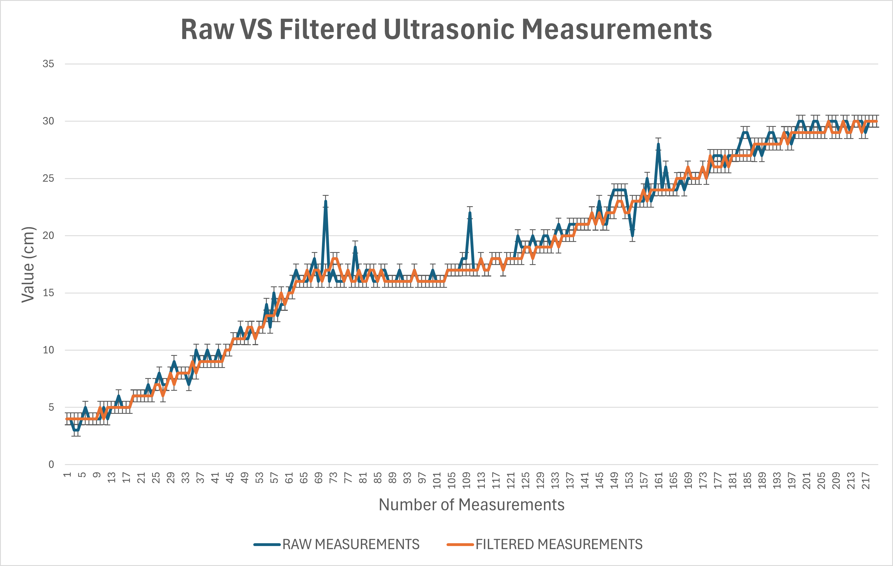

# 8. Ultrasonic Distance Sensing

## 8.1 Ultrasonic Sensors for Distance Detection

While the PixyCam handles vision-based object recognition, **Ultrasonic Sensors** provide critical real-time distance measurements to nearby walls. These sensors complement the vision system by offering accurate proximity data. Particularly, they are used for recentering and avoiding collisions.

### Hardware Definitions

The following preprocessor definitions specify the Arduino pins connected to the ultrasonic sensors:

```cpp
// Left ultrasonic sensor trigger and echo pins
#define US_LEFT_TRIG 15
#define US_LEFT_ECHO 17
// Right ultrasonic sensor trigger and echo pins
#define US_RIGHT_TRIG 11
#define US_RIGHT_ECHO 13

// Front ultrasonic sensor trigger and echo pins
#define US_FRONT_TRIG 7
#define US_FRONT_ECHO 9
 
// Max detection distance for the definition of the ultrasonic sensors
#define MAX_DISTANCE 200
```

### Global Objects and Constants

```cpp
NewPing sonarLeft(US_LEFT_TRIG, US_LEFT_ECHO, MAX_DISTANCE);  // Left ultrasonic sensor object
NewPing sonarRight(US_RIGHT_TRIG, US_RIGHT_ECHO, MAX_DISTANCE); // Right ultrasonic sensor object
NewPing sonarFront(US_FRONT_TRIG, US_FRONT_ECHO, MAX_DISTANCE); // Front ultrasonic sensor object
```

### Initialization (`void initUltrasonic()`)

* **Purpose**: Performs any necessary initialization for the ultrasonic sensors.
* **Operation**: For the `NewPing` library, object creation in global scope is sufficient for basic setup. Therefore, this function contains no explicit commands beyond this. It can be used for future advanced configurations.

## 8.2 Distance Measurement (`int getDistance(NewPing& sonar)`)

* **Purpose**: Acquires multiple distance measurements from a single ultrasonic sensor and applies a two-stage filtering process to enhance accuracy, reduce noise, and discard anomalous readings. This robust method ensures more reliable distance data.

* **Operation**:  
  1. **First Stage (Range and Initial Averaging)**:
     * The function takes `NUM_SAMPLES` (e.g., 5) readings from the sensor using `sonar.ping_cm()`. It is crucial to consider the number of samples. An exaggerated number of samples could achieve no difference in comparison to a lower number, but may cause a significant delay or slow down the robot's operation.
     * The non-blocking `safeDelay(3);` is introduced between pings to prevent echo interference and ensure measurement stability.
     * Each reading `d` is checked against `MIN_VALID_DISTANCE` (e.g., 4 cm) and `MAX_VALID_DISTANCE` (e.g., 80 cm). Readings outside this valid range (e.g., sensor errors, objects too close/far) are **discarded**.
     * Valid readings are stored in a `samples` array, and their sum is accumulated. `validCount` tracks how many valid readings were obtained.
     * If `validCount` is zero (no valid readings), the function returns 0.
       
     * An initial `avg` (average) is calculated from the `validCount` readings.

     ```cpp
     int getDistance(NewPing& sonar) {
       const int NUM_SAMPLES = 5;
       const int MAX_VALID_DISTANCE = 80;
       const int MIN_VALID_DISTANCE = 4;
       const int STABILITY_THRESHOLD = 10;

       int samples[NUM_SAMPLES];
       int validCount = 0;
       int sum = 0;

       for (int i = 0; i < NUM_SAMPLES; i++) {
         int d = sonar.ping_cm();
         delay(3); // brief delay to avoid interferences

         if (d >= MIN_VALID_DISTANCE && d <= MAX_VALID_DISTANCE) {
           samples[validCount++] = d;
           sum += d;
         }
       }
       if (validCount == 0) return 0;
       int avg = sum / validCount;
     ```

  2. **Second Stage (Outlier Rejection - Median-like Filtering)**:
     * This stage refines the data by discarding **outliers** that deviate significantly from the initial average.
     * For each valid `sample` from the first stage, its absolute difference from the `avg` is calculated: `abs(samples[i] - avg)`.
     * If this difference is less than or equal to `STABILITY_THRESHOLD` (e.g., 10 cm), the reading is considered stable and is included in a new sum (`sum`) and `filteredCount`. This effectively **disregards readings that are likely noise or anomalies**.
       
     * If `filteredCount` is zero (no readings passed the second filter), the function returns 0.

     ```cpp
       // ... (first stage code) ...

       sum = 0;
       int filteredCount = 0;
       for (int i = 0; i < validCount; i++) {
         if (abs(samples[i] - avg) <= STABILITY_THRESHOLD) {
           sum += samples[i];
           filteredCount++;
         }
       }
       if (filteredCount == 0) return 0;
       return sum / filteredCount;
     }
     ```

  4. **Result**: The final average is calculated from the `sum` of the `filteredCount` readings, providing a highly **reliable and noise-corrected distance measurement**. For a comparison between **raw vs filtered measurement**, you can refer to the data analysis on ultrasonic sensors' calibration. Here you can visualize the difference between the error dispersion when applying our filter to an ultrasonic sensor measuring the same distance.

    

    For the complete data recolection and analysis, refer to: [Data Graphs and Analysis](./../assets/data_graphs/)

## 8.3 Wall Avoidance for **Open Challenge Round** (**`void avoidWall(int correctionAmount)`**)

* **Purpose**: This function actively monitors the robot's distance to nearby walls using ultrasonic sensors and **adjusts its `targetYaw`** to prevent collisions or significant deviation from the desired path. It incorporates logic to prevent over-correction and ensures stable navigation.

* **Parameters**:
  * `correctionAmount`: An integer representing the magnitude of the `targetYaw` adjustment (e.g., how much to turn).

* **Operation**:
  1. **Correction Eligibility Check**: Before attempting any correction, the function checks several conditions to ensure a stable and appropriate moment for adjustment:
     * `!turningInProgress`: Ensures no active turn is in progress, preventing conflicting steering commands.
     * `!correctionState`: Checks if a correction is **not currently active**.
     * `lapTurnCount != 0`: Prevents corrections during the initial phase (first lap turn), assuming the robot is already in a straight orientation.
       
     * A **cooldown period** must have elapsed since the last correction (managed by `correctionCooldownMillis` and `lastCorrectionTime`, though the explicit check is in `correctionCooldown()` itself).

    ```cpp
     void avoidWall(int correctionAmount) {
       // A correction is made only if there is no turn in progress and no correction was made in a cooldown time
       // A correction will not be made in the first lap turn, it is already placed in a straight orientation
       if (!turningInProgress && !correctionState && lapTurnCount != 0) {
         NewPing sonar = (direction < 0) ? sonarRight : sonarLeft;
         int distance = getDistance(sonar);
    ```

  2. **Sensor Selection**: Based on the `direction` variable, the appropriate ultrasonic sensor (`sonarRight` or `sonarLeft`) is selected for distance measurement.

  3. **Distance Acquisition**: The `getDistance()` function is called to obtain a filtered and reliable distance measurement to the relevant wall.

  4. **Trajectory Adjustment Logic**:
     * **Too Close**: If the `distance` to the wall is **less than 20 cm** (and not zero), the `turnTargetYaw` is adjusted to steer the robot **away from the wall** (by adding `correctionAmount` in the opposite `direction`).
     * **Too Far**: Conversely, if the `distance` is **greater than 40 cm** (and not zero), the `turnTargetYaw` is adjusted to steer the robot **towards the wall** (by adding `correctionAmount` in the same `direction`).

  5. **State Update and Cooldown Reset**: Upon making a correction, `correctionState` is set to `true` to indicate an active correction, the new `turnTargetYaw` is applied via `setTargetYaw()`, and `lastCorrectionTime` is updated to initiate the cooldown period.

     ```cpp
         // ... (avoidWall - initial checks and distance acquisition) ...

         if(distance < 20 && distance != 0) { // if it is too close to the wall
           turnTargetYaw = (turnTargetYaw + (correctionAmount * -direction));
           correctionState = true;
           setTargetYaw(turnTargetYaw);
           lastCorrectionTime = millis(); // Registers the last correction time
         }

         else if (distance > 40 && distance != 0) { // if it is too far from the wall
           turnTargetYaw = (turnTargetYaw + (correctionAmount * direction));
           correctionState = true;
           setTargetYaw(turnTargetYaw);
           lastCorrectionTime = millis(); // Registers the last correction time
         }
       }
     }
     ```

---

### Correction Cooldown Management (**`void correctionCooldown()`**)

* **Purpose**: This function is responsible for managing the **cooldown period** after a wall correction has been applied. It ensures that subsequent corrections are not triggered too rapidly, preventing erratic steering and oscillatory behavior.

* **Operation**:
  1. **Cooldown Check**: It continuously compares the current `millis()` timestamp with `lastCorrectionTime` (the time of the last correction).
  2. **State Reset**: If the elapsed time (`millis() - lastCorrectionTime`) exceeds `correctionCooldownMillis` (the defined cooldown duration), it indicates that the cooldown period has passed. In this case, `correctionState` is **reset to `false`**, allowing the `avoidWall` function to consider new corrections.

     ```cpp
     void correctionCooldown() {
       if (millis() - lastCorrectionTime > correctionCooldownMillis) {
         correctionState = false;
       }
     }
     ```

---

## 8.4 Post-Evasion Recentering Logic for the **Obstacle Challenge Round** (**`void recentreIfNeeded()`**)

This function implements a conditional recentering mechanism designed to adjust the robot's lateral position relative to a wall immediately after completing an obstacle evasion. Its primary goal is to correct any residual lateral deviation that might have occurred during the evasion maneuver, ensuring the robot maintains an optimal path.

* **Purpose**: To perform a quick, directional lateral correction based on the signature of the last evaded obstacle and proximity to the nearest wall, ensuring the robot is optimally positioned for subsequent navigation.
* **Operation**:
    1.  **Correction State Check**: `if (correctionState == true) return;`: The function first checks a global boolean flag, `correctionState`. If this flag is already set to `true`, it indicates that a recentering correction has already been executed within the current turn cycle. In such a scenario, the function immediately terminates to prevent redundant corrections.
       
    2.  **Signature-Based Sensor Selection**: The function proceeds only if no prior correction has been made. It then determines which ultrasonic sensor to utilize based on the `lastSignature` variable, which stores the color signature of the most recently evaded obstacle:
        * `if (lastSignature == SIGNATURE_RED)`: If the last evaded obstacle was red (indicating an evasion maneuver to the right), the robot anticipates being closer to the right wall, and does not want to measure with the left ultrasonic sensor, as it may confuse the obstacle red with the wall. Therefore, `int distance = getDistance(sonarRight);` is called to obtain a distance reading from the right-mounted ultrasonic sensor.
        * `else if (lastSignature == SIGNATURE_GREEN)`: Conversely, if the last evaded obstacle was green (implying an evasion maneuver to the left), the robot expects to be closer to the left wall. In this case, `int distance = getDistance(sonarLeft);` is used to query the left-mounted ultrasonic sensor.
        * `else return;`: If `lastSignature` does not correspond to either `SIGNATURE_RED` or `SIGNATURE_GREEN` (e.g., it's `0` or an unrecognized value), no recentering action is performed, and the function exits. This happens when the robot just started running or when an obstacle was not avoided yet in the current turn.
          
    3.  **Proximity-Based Correction Trigger**: Following the distance measurement from the relevant sensor:
        * `if (distance < 30 && distance != 0)`: A correction is triggered if the measured `distance` to the wall is less than 30 cm and the distance reading is not zero (which often indicates an invalid or out-of-range measurement).
        * **Directional Steering Correction**:
            * If `lastSignature == SIGNATURE_RED` (right evasion, close to right wall): `steeringServo.write(SERVO_LEFT-5);` commands the steering servo to turn sharply to the left.
            * If `lastSignature == SIGNATURE_GREEN` (left evasion, close to left wall): `steeringServo.write(SERVO_RIGHT+5);` commands the steering servo to turn sharply to the right.
        * **Correction Duration and State Update**:
            * `safeDelayColor(1000);`: A blocking delay of 1000 milliseconds (1 second) is introduced, during which the robot executes the sharp steering correction. The `safeDelayColor` function ensures that color sensor operations (specifically `detectFloorColor`) are continuously checked even during this delay, allowing for an early exit if a floor turn signal is detected.
            * `correctionState = true;`: Immediately after executing the correction, the `correctionState` flag is set to `true`. This prevents subsequent `recentreIfNeeded()` calls within the same turn cycle from initiating another correction.
        * `else return;`: If the measured distance does not meet the specified criteria (`< 30 cm` and `!= 0`), no correction is necessary, and the function exits.
  
## 8.5 Side PID for the **Open Round** (**`void avoidWallPID()`**)

* **Purpose**: The `avoidWallPID()` function is designed to keep the robot at a safe and constant distance from a wall while it is moving forward. It uses a PID-based lateral correction to adjust the robot’s target yaw (its heading) so it avoids drifting.
* **Operation**:
1. **Conditions**: Similarly to `avoidWall()`, this only runs when:
     * `if (!turningInProgress && lapTurnCount != 0) {`: The robot is not in the middle of a turn (`turningInProgress == false`) and only after the first lap count (`lapTurnCount != 0`).
2. **Timing Control**: It updates only at specific time intervals to avoid excessive calculations.
     * `if (now - lastWallPIDUpdate < wallPIDInterval) return;`: Checks if enough time has passed since the last update. If not, stops the function to avoid updating too fast.
     * `lastWallPIDUpdate = now;`: Updates the timestamp to know when the last calculation happened.
  ```cpp
void avoidWallPID() {
  if (!turningInProgress && lapTurnCount != 0) {
    unsigned long now = millis();
    if (now - lastWallPIDUpdate < wallPIDInterval) return; // espera al próximo intervalo
    lastWallPIDUpdate = now; // se actualiza el tiempo de ejecución

    NewPing sonar = (direction < 0) ? sonarRight : sonarLeft;
    int distance = getDistance(sonar);
```
3. **Setup**: Selects the correct sonar sensor, reads distance, and ensures the reading is valid before continuing.
   * `NewPing sonar = (direction < 0) ? sonarRight : sonarLeft;`: Determines which ultrasonic to use. If `direction < 0`, then the right sonar is used. Otherwise, the left sonar is used.
   * `int distance = getDistance(sonar);`: Reads from the sonar sensor and saves that value in the variable `distance`.
   * `if(distance == 0) return;`: The function ends if the ultrasonic sensor does not detect anything.
4. **Lateral PD Control**: Computes the proportional-derivative correction needed to maintain a steady 20 cm from the wall.
   * `float error = distance - 20;`: Estimates error to maintain 20 cm distance from the wall.
   * `float derivative = error - S_previousError;`: Calculates derivative, which tells how much the error has changed since last time.
   * `int correction = constrain((int)(S_Kp * error + S_Kd * derivative), -10, 10);`: Computes the PD correction value using the proportional and derivative; afterwards, it  limits the result between −10 and +10.
   * `S_previousError = error;`: Stores the current error. Needed for the derivative.
 5. **Yaw Adjustment Logic**: Updates the robot’s yaw target when the PD correction changes, ensuring smooth directional adjustments.
   * `if (lastCorrection != correction)`: Checks if the correction value has changed since the last cycle.
   * `int err = currentCorrectionAmount - correction;`: Calculates the change difference between current and new correction.
   * `turnTargetYaw = (turnTargetYaw - (err * direction));`: Adjusts the yaw to target yaw.
   * `lastCorrection = correction;`: Updates the stored correction value to the new one.
   * `currentCorrectionAmount = currentCorrectionAmount - err;`: Adjusts the stored correction values.
6. **New Target Yaw Application**: Applies the updated yaw target so the robot can steer toward the corrected orientation.
   * `setTargetYaw(turnTargetYaw);`: Sets a new target yaw, enabling the robot to steer accordingly.
```cpp
if(distance == 0) return;
    float error = distance - distanceToWall; 
    float derivative = error - S_previousError;
    int correction = constrain((int)(S_Kp * error + S_Kd * derivative), -10, 10);

    S_previousError = error;
    Serial.println(error);

    if (lastCorrection != correction) {
      int err = currentCorrectionAmount - correction;
      turnTargetYaw = (turnTargetYaw - (err * direction));
      Serial.println("Adjusting Yaw");
      lastCorrection = correction;
      currentCorrectionAmount = currentCorrectionAmount - err;
    }

    setTargetYaw(turnTargetYaw);
```
This effectively “nudges” the robot’s heading so that it moves slightly away from or closer to the wall.

---

[Back to Main README.md Index](./../README.md)
