# 10. 3D Modeling and Mechanics

This section details the comprehensive approach to the mechanical design and fabrication of the VizDrive robot. Our methodology emphasizes precision, durability, and a lightweight structure.

## 10.1 3D Modeling Tool: Blender

We selected **Blender** as our primary 3D modeling software.

### Design Process in Blender

Our mechanical design workflow involved an iterative process:

1. **Conceptualization:** Initial sketches and rudimentary models were developed to define the robot's overall form factor and the preliminary placement of its components.
2. **Component Integration:** Detailed designs were created for mounts and enclosures, ensuring a perfect fit for all selected electronic components, including the Mega 2560 Pro (Embed), motor drivers, sensors, and battery.
3. **Structural Optimization:** Emphasis was placed on minimizing the robot's overall weight while maximizing its rigidity and structural strength. This involved applying techniques such as optimizing internal infill patterns during 3D printing.
4. **Iterative Refinement:** Physical prototypes were printed, their fit and function rigorously tested, and necessary design adjustments were iteratively made in Blender based on the empirical results.
5. **STL Export:** Finalized designs were exported as `.stl` files, the industry-standard format for 3D printing.

## 10.2 Mechanical Characteristics and Design Principles

VizDrive's mechanical design prioritizes precise and stable locomotion, integrating specific features to optimize performance.

* **Rear-Wheel Drive (RWD) Configuration**: The robot utilizes a RWD setup where a single DC motor drives the rear wheels via a solid axle. Front-wheel steering is achieved through a servo-controlled mechanism.
  * **Propulsion Motor**: A **Hobby Gearmotor with a 48:1 gearbox** is employed for the rear drive, selected for its ample torque suitable for various terrains.
  * **Steering Actuator**: A **Servo Motor SG90** is used to precisely control the angular position of the front steering wheels.
 
| Old Robot | New Robot |
| ---------------- | ---------------- |
| 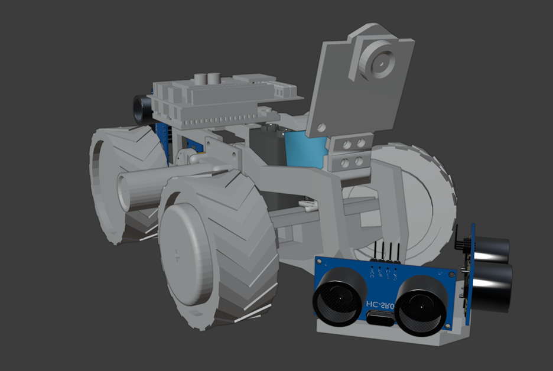 | 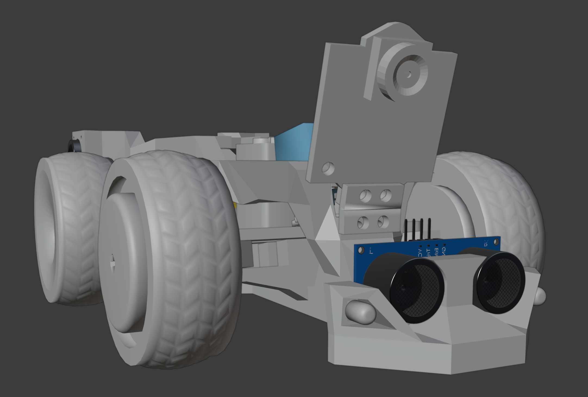 |

* **Light Frame Chassis**: The chassis is engineered as a lightweight beam structure. This compact design enhances driving precision and overall durability.

  * **Old Chassis**:

  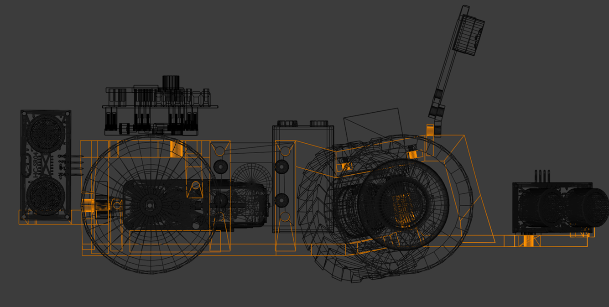

  * **New Chassis**:

  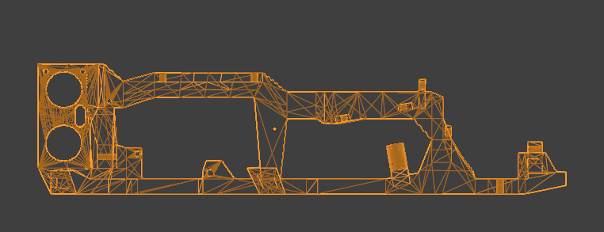

* **Tolerance Management**: Strategic variations in manufacturing tolerances were applied during part design:
  * **Snug Fit**: Components secured by screws are designed for a tight fit to ensure rigidity.
  * **Higher Tolerance**: Wheel and steering mechanisms incorporate greater tolerance. This allows for slight movement, reducing friction, and inadvertently contributes to a degree of passive suspension, which helps in accommodating minor ground irregularities and improving stability.

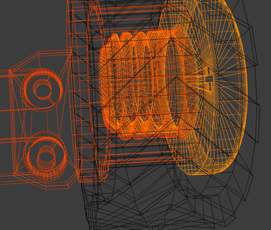

* **Caster Angle**: To mitigate any inherent imprecision arising from steering tolerances, a **caster angle of 10°** has been implemented. This geometric arrangement naturally biases the steering wheels to return to a centered, straight-ahead position, improving straight-line tracking stability.

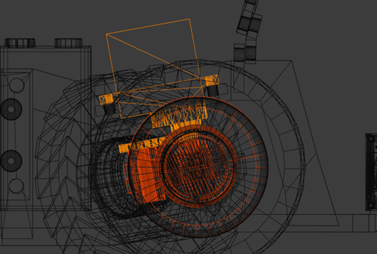

* **Steering Angle Capability**: The steering system is designed to achieve a **45-degree turn in each direction**. This range enables sharp maneuvers, including specialized actions like parallel parking.

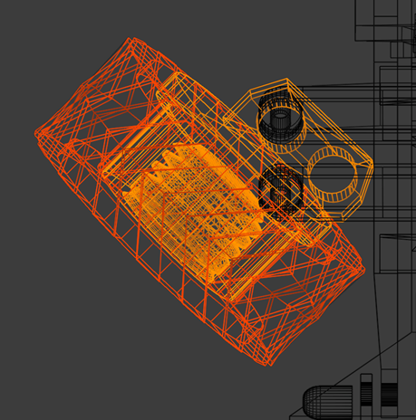

* **Screw Orientation**: Screws used in critical drivetrain assemblies are oriented to self-tighten as the robot moves forward. This design detail prevents screws from loosening and wheels from detaching due to friction, a particularly important consideration for 3D-printed hub designs that offer bidirectional screw orientation options.

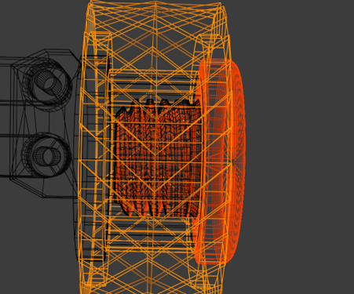

* **Bumper**: Orientation is reset using the bumper, aligning the robot to the outer wall which is crucial for long-term stable gyroscope functionality, mitigating not only drift, but also possbile noise caused by the robot's movement.

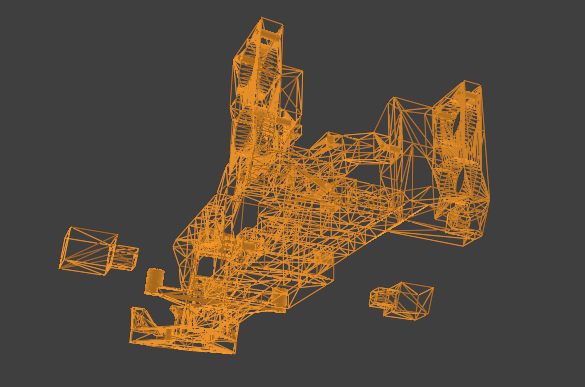

* **Servo Motor Support**: A secure servo mount was implemented to acquire steering stability and reduce possible errors. The caster angle implemented is working in conjunction with this system to achieve precise maneuvers.

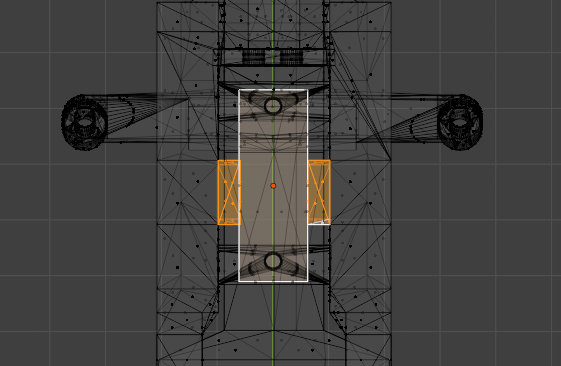

* **Ultrasonic Sensor Mount**: Snug-fit screwless mounts allow fast repairs and simpler building during competition. Tolerance management principles were applied to fine tune friction between the chassis and the sonars.

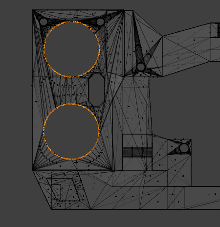

* **LED Headlights**: Additional illumination improves camera readings during low light scenarios. The PixyCam's built-in LEDs enhance lighting and suports the robot's headlights.

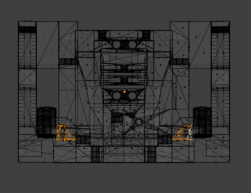

* **Flat Base**: The redesigned chassis has an array of benefits during the construction phase, not only facilitating it's assembly, but also improving printing time, quality, and durability.

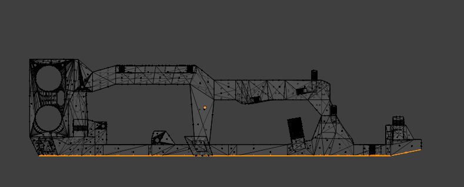

* **Double Camera Mount**: During the development of ViZio, multiple camera angles were tested to identify the best view. However, camera movement was restricted to a single fixed slot; hence, to further amplify flexibility, dual camera mounts were implemented into our new model.

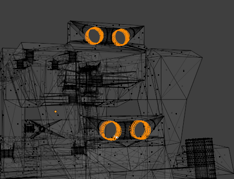

## 10.3 3D Printing and Parameters

All custom mechanical parts for VizDrive were designed in Blender and fabricated using **PLA (Polylactic Acid)** filament via a **Creality Ender 3 3D printer**. PLA was selected for its ease of printing and sufficient strength for the application. While the following parameters are our standard settings, minor adjustments may be made for optimization.

### Chassis

* **Description:** The primary structural frame, designed to be lightweight yet rigid, providing essential mounting points for motors, sensors, and the main controller.
* **3D Model (STL):** [Chassis](./../models/chassis/chassis.stl)
* **Updated 3D Model (STL):** [Chassis](./../models/chassis/chassis2.0.stl)
* **Interactive 3D Model:** [Chassis Embed](https://vizdrive.github.io/VizDrive_WRO2025/embeds/interactive_chassis)
* **Interactive Updated 3D Model** [Updated Chassis Embed](https://vizdrive.github.io/VizDrive_WRO2025/embeds/interactive_chassis2)
* **Printing Parameters:**
  * Infill Type: Honeycomb
  * Infill Density: 15%
  * Layer Height: 0.28mm
  * Nozzle Temperature: 200°C
  * Bed Temperature: 60°C
  * Print Speed: 150mm/s

### Front Wheel Rims

* **Description:** Custom-designed rims precisely shaped to fit into the wheel hubs.
* **3D Model (STL):** [Wheels](./../models/wheels/wheel_rims.stl)
* **Interactive 3D Model:** [Wheels Embed](https://vizdrive.github.io/VizDrive_WRO2025/embeds/interactive_rims)
* **Printing Parameters:**
  * Infill Type: Honeycomb
  * Infill Density: 20%
  * Layer Height: 0.28mm
  * Nozzle Temperature: 200°C
  * Bed Temperature: 60°C
  * Print Speed: 150mm/s

### Front Wheel Hubs with Screws

* **Description:** Hubs designed to connect directly to the steering rod, incorporating integrated screws to securely hold the wheels in place.
* **3D Model (STL):** [Wheel Hub](./../models/wheels/wheel_hub.stl)
* **Interactive 3D Model:** [Wheel Hub Embed](https://vizdrive.github.io/VizDrive_WRO2025/embeds/interactive_hub)
* **Printing Parameters:**
  * Infill Type: Honeycomb
  * Infill Density: 15%
  * Layer Height: 0.28mm
  * Nozzle Temperature: 200°C
  * Bed Temperature: 60°C
  * Print Speed: 150mm/s

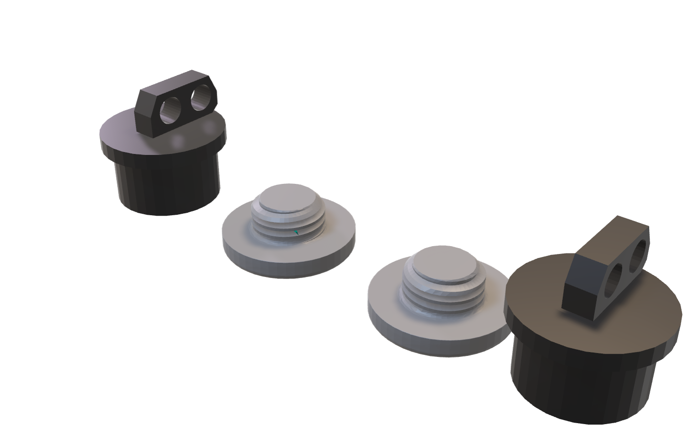

### Encoder Wheel and Rear Wheel

* **Description:** A precisely designed wheel featuring 16 distinct markings or slots, intended for use with an optical encoder sensor to ensure accurate odometry (distance and speed measurement). A standard rear wheel without an encoder rim is also used.
* **3D Model (STL):** [Wheel Encoder](./../models/wheels/encoder_wheel.stl)
* **Interactive 3D Model:** [Encoder Wheel Embed](https://vizdrive.github.io/VizDrive_WRO2025/embeds/interactive_rear_wheels)
* **Printing Parameters:**
  * Infill Type: Honeycomb
  * Infill Density: 20%
  * Layer Height: 0.28mm
  * Nozzle Temperature: 200°C
  * Bed Temperature: 60°C
  * Print Speed: 150mm/s

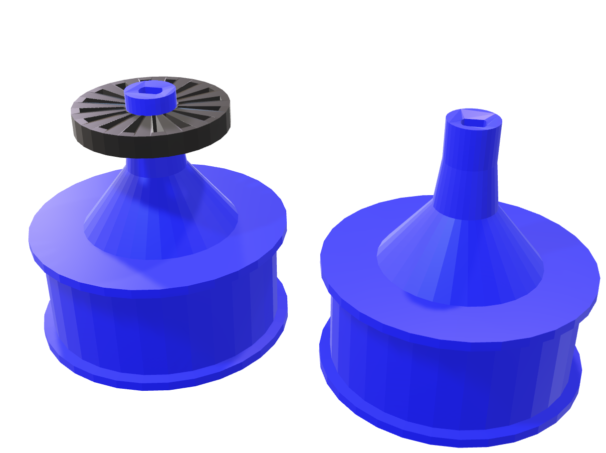

### Steering Rods and Camera Support

* **Description:** Components for the steering rods that connect to the wheels, along with a camera mount designed with a slight 15° pitch angle for optimal PixyCam positioning.
* **3D Model (STL):** [Steering Rods](./../models/steering/steering_rods.stl)
* **Interactive 3D Model:** [Steering Rods Embed](https://vizdrive.github.io/VizDrive_WRO2025/embeds/interactive_steering_rods)
* **Printing Parameters:**
  * Infill Type: Honeycomb
  * Infill Density: 15%
  * Layer Height: 0.28mm
  * Nozzle Temperature: 200°C
  * Bed Temperature: 60°C
  * Print Speed: 150mm/s

## 10.4 3D Printing Process

The fabrication process utilizing the Creality Ender 3 3D printer involved the following steps:

1. **Slicing:** STL models were converted into G-code (machine instructions) using Creality's slicer software. This step incorporates all specified printing parameters.
2. **Printing:** PLA filament was loaded, and the G-code was executed to build the parts layer by layer.
3. **Post-Processing:** Minimal post-processing was required for most components, primarily involving support material removal and light sanding to ensure aesthetic quality and a precise fit.

---

[Back to Main README.md Index](../README.md)
