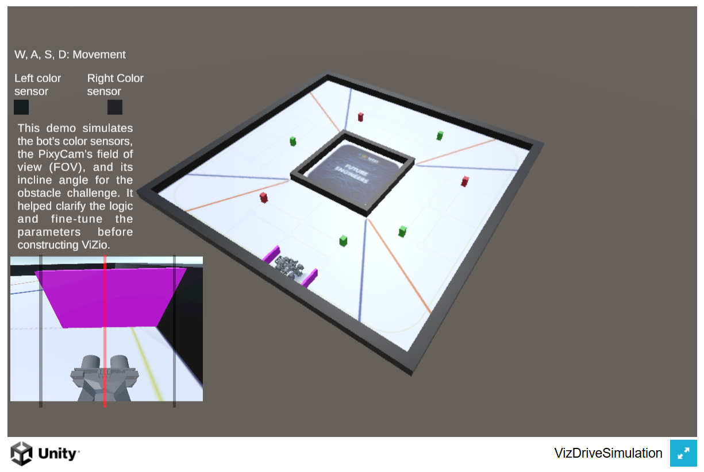
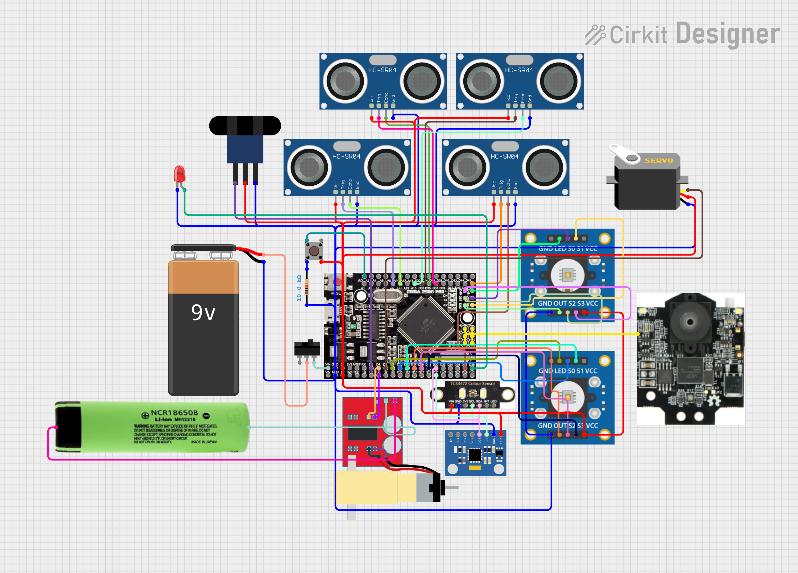

# 11. Other Resources

This section provides links to supplementary materials, diagrams, and other relevant resources that offer further insight into the VizDrive robot's design, construction, and operation.

This document is primarily intended to serve as a **user manual**, with the set of instructions to build, calibrate, and operate our robot.

## 11.1 3D Models

All custom mechanical parts designed for VizDrive are available as STL files. 
These models can be used for replication, modification, or further study of the robot's physical structure.

* **Chassis:** The main structural frame of the robot.
  * [View 3D Model (STL)](./../models/chassis/chassis.stl)
* **Front Wheel Rims:** Custom-designed rims for the front wheels.
  * [View 3D Model (STL)](./../models/wheels/wheels.stl)
* **Front Wheel Hubs with Screws:** Hubs connecting to the steering rod, including screw designs.
  * [View 3D Model (STL)](./../models/wheels/wheel_hub.stl)
* **Encoder Wheel and Rear Wheel:** Precision-designed wheel with encoder markings and standard rear wheel.
  * [View 3D Model (STL)](./../models/encoder_wheel/)
* **Steering Rods and Camera Support:** Components for steering rods and the PixyCam mount.
  * [View 3D Model (STL)](./../models/steering/steering_rods.stl)
 
For the 3D printing guide, visit the [3D Modeling](./10_3d_modeling.md) document. It explains all the parameters and configuration we used for the Creality Ender 3 3D printer.

Before the fabrication of the robot, you can also visualize the **Unity simulator** we created during the modeling process, which is available as a GitHub pages hosted web embed here: [Unity Simulator](.././embeds/Unity_simulator/README.md). Click on the image to access the **Unity web player**.

## 11.2 Components and Wiring

For the construction of our robot, we tried to utilize the most accessible sensors and actuators. Most of them are typically found in standard Arduino kits.

To get the list of all components, refer to the [**Hardware Components**](02_hardware_components.md) document. Which also details on their specifications and utilization.
And for a look into the pin configuration and interface, refer to the [**Sensors and Pin Configuration**](04_sensors_and_pin_configuration.md) document.

For the wiring, we created a custom PCB design. All the connections are traced in the **Electromechanical Diagram** made with Cirkit. 
Which also has an [**interactive web design**](https://vizdrive.github.io/VizDrive_WRO2025/embeds/interactive_circuit), created with an HTML embed. It also includes a ChatBot that could help you to understand the general operation of the circuit and its components' connection.

## 11.3 Building Instructions

We created a 3D animation that showcases the detailed building instructions for all the components into our robot's 3D models.
The video also includes the use of different screws and nuts to ensure the correct tolerance and orientation for a perfect functioning.

For an in-depth explanation into this and other concepts taken into consideration during the planification of 3D parts, you can visit the [Robot Mobility](05_robot_mobility.md) document.
As well, the [3D Modeling](10_3d_modeling.md) explains the principles used during the construction of our robot.

## 11.4 Sensors' Calibration

### MPU-6050 Gyroscope + Accelerometer

The **MPU-6050** was calibrated by calculating the offset through averaging a specific number of samples. The empirical data collected during MPU calibration, demonstrating the reduction in accumulated error as the number of samples increases, can be visualized in the graph below.

This **Accumulated Error vs. Number of Samples** graph indicates that 250 samples are sufficient to achieve an accuracy of 
±0.01 in our sensor model. However, this may vary depending on the specific gyroscope and accelerometer model.

We provide our calibration code, which calculates the offset accumulation of the MPU-6050 over a defined period, making the necessary data analysis for calibration easily accessible. When using this code, ensure the MPU-6050 remains static.

For more information on MPU-6050 orientation control, please refer to the [**PID Gyroscope Control**](06_pid_gyroscope_control.md) document.

### HC-SR04 Ultrasonic Sensor

The HC-SR04 ultrasonic sensor required an algorithm to mitigate noise and ensure more accurate measurements. We developed a custom median and outlier filter for this purpose. The **Raw vs. Filtered Ultrasonic Measurement Graph** illustrates the difference between the raw and filtered ultrasonic measurements.

It is crucial to evaluate the optimal number of samples for the filter to maintain consistent measurements without impacting performance. We highly recommend using **5 samples** for the filter, but also provide the [**ultrasonic sensor median filter code**](.././src/ultrasonic_median_filter/ultrasonic_median_filter.ino) if you want to visualize your own data.

For more information on HC-SR04 ultrasonic measurement and filter, please refer to the [**Ultrasonic Sensing**](08_ultrasonic_distance_sensing.md) document.

## 11.5 PID Control Parameters

The PID Control parameters are empirically tuned following the next set of steps:

* **Kp (Proportional Gain)**: is adjusted by gradually increasing it until the robot starts oscillating around the desired path (indicating overcorrection), then slightly reducing it to achieve a balanced response.
* **Kd (Derivative Gain)**: is tuned after Kp to smooth the response, reduce overshoot, and dampen oscillations, leading to a more precise and stable trajectory.
* **Ki (Integral Gain)**: is used to correct accumulative errors. It is not implemented in the code due to over-correction and wind-up (more information on this topic).

We highly recommend visiting our documentation on this topic, to understand the PID control parameters adjustment and the **Ki parameter** exclusion [**PID Gyroscope Control**](06_pid_gyroscope_control.md)

## 11.6 Code Structure

The most recent and complete version of our code is located in the `./src/main_control` folder. This code is optimally organized into various modules with `.cpp` and `.h` files, alongside a `main.ino` file. However, for presentation and readability, it's provided as a single, functional code.

While code modularity is an optional step for more sophisticated and larger systems, for simplicity, the different sections are clearly separated by comments within the code itself.
For more information, refer to our documentation on the [**Software Architecture**](03_software_architecture.md).

If you notice any inconsistency on this code functionality, feel free to contact us via email: **<vizdrive.wro@gmail.com>**!
Of course, we are also open to any recommendation, inquiry or comment on any topic.

---

[Back to Main README.md Index](../README.md)
