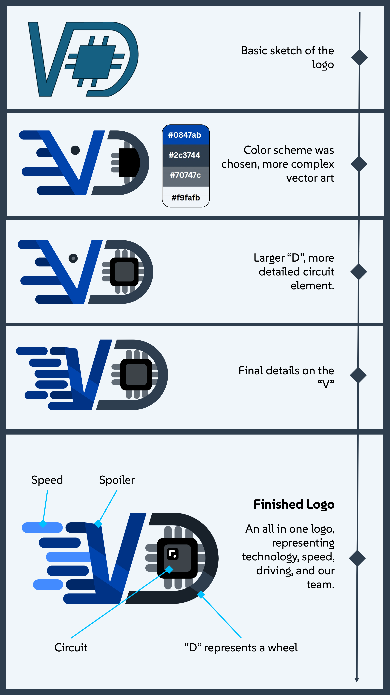
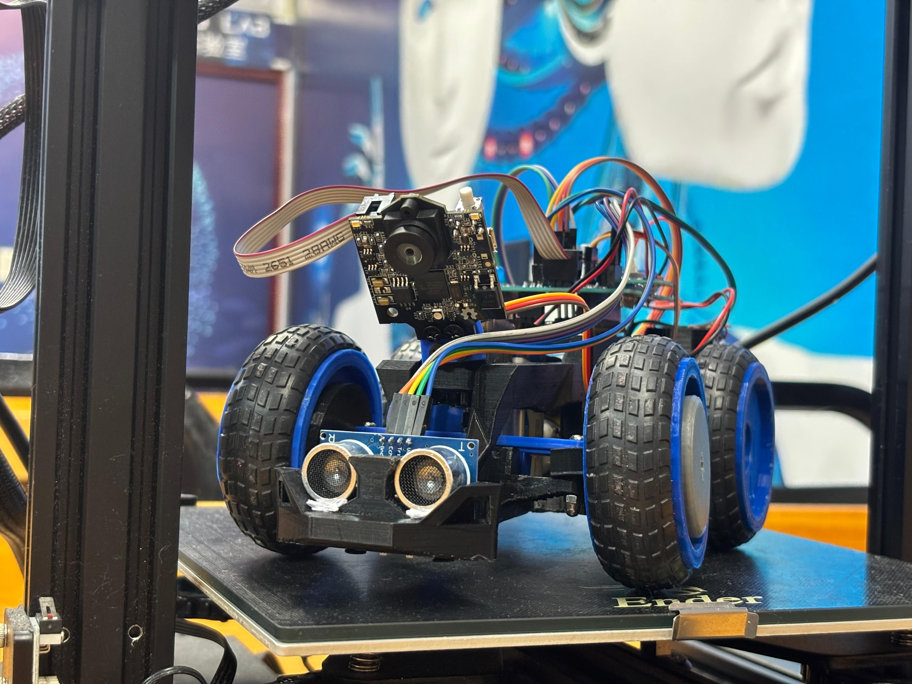
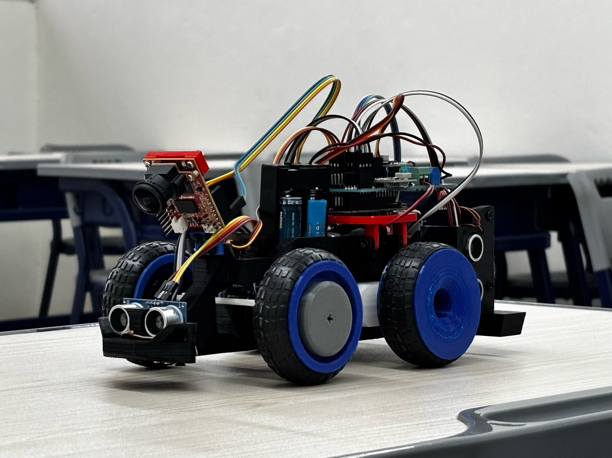
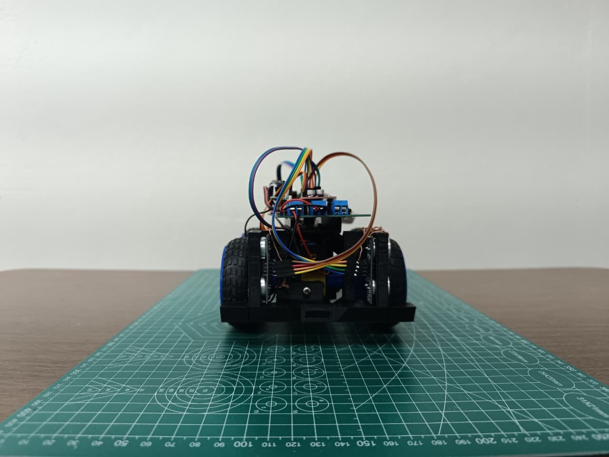
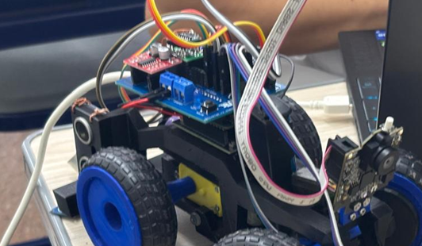
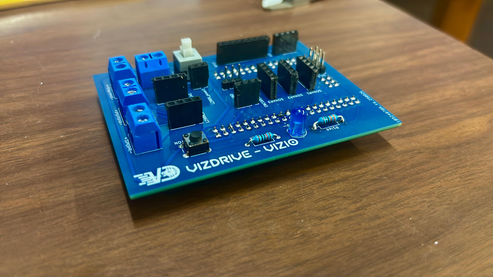
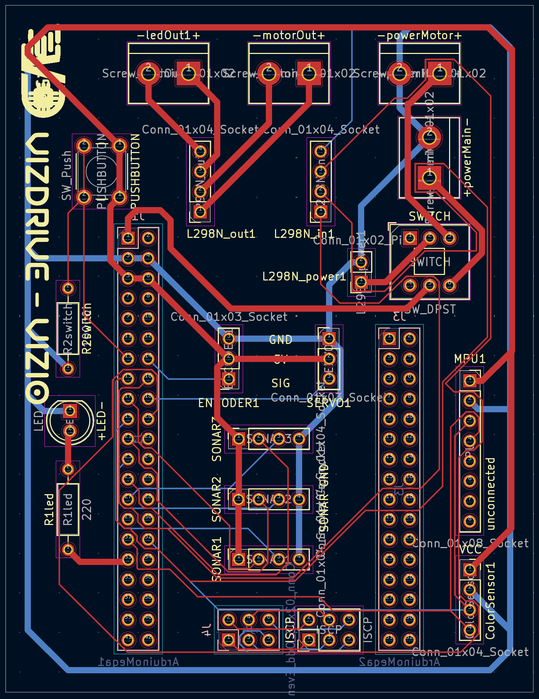
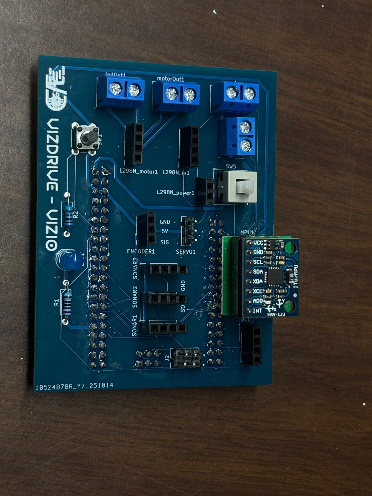
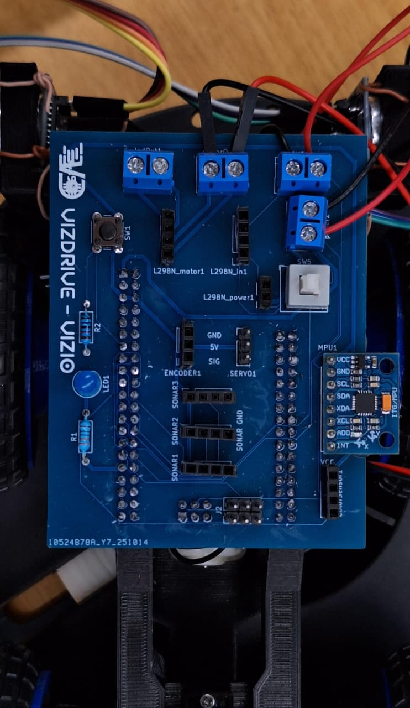

# 11. Other Resources

This section provides links to supplementary materials, diagrams, and other relevant resources that offer further insight into the VizDrive robot's design, construction, and operation.

This document is primarily intended to serve as a **user manual**, with the set of instructions to build, calibrate, and operate our robot.

## 11.1 3D Models

All custom mechanical parts designed for VizDrive are available as STL files. 
These models can be used for replication, modification, or further study of the robot's physical structure.

* **Chassis:** The main structural frame of the robot.
  * [View 3D Model (STL)](./../models/chassis/chassis.stl)
  * [View Updated 3D Model (STL)](./../models/chassis/chassis2.0.stl)
  * [View International 3D Model (STL)](./../models/chassis/ViZioInternationalMotorFix.stl)
  * [View 2026 Models (STL)](./10_3d_modeling.md#chassis)
* **Front Wheel Rims:** Custom-designed rims for the front wheels.
  * [View 3D Model (STL)](./../models/wheels/wheel_rims.stl)
* **Front Wheel Hubs with Screws:** Hubs connecting to the steering rod, including screw designs.
  * [View 3D Model (STL)](./../models/wheels/wheel_hub.stl)
* **Encoder Wheel and Rear Wheel:** Precision-designed wheel with encoder markings and standard rear wheel.
  * [View 3D Model (STL)](./../models/wheels/encoder_wheel.stl)
* **Steering Rods and Camera Support:** Components for steering rods and the PixyCam mount.
  * [View 3D Model (STL)](./../models/steering/steering_rods.stl)

For the 3D printing guide, visit the [3D Modeling](./10_3d_modeling.md) document. It explains all the parameters and configuration we used for the Creality Ender 3 3D printer.

You can also visualize the **Unity simulator** we created during the modeling process prior to the fabrication of the robot, which is available as a GitHub pages hosted web embed here: [Unity Simulator](.././embeds/Unity_simulator/README.md). Click on the image to access the **Unity web player**.

## 11.2 Components and Wiring

For the construction of our robot, we tried to utilize the most accessible sensors and actuators. Most of them are typically found in standard Arduino kits.

To get the list of all components, refer to the [**Hardware Components**](02_hardware_components.md) document. Which also details on their specifications and utilization.
And for a look into the pin configuration and interface, refer to the [**Sensors and Pin Configuration**](04_sensors_and_pin_configuration.md) document.

For the wiring, we created a custom PCB design. All the connections are traced in the **Electromechanical Diagram** made with Cirkit.
Which also has an [**interactive web design**](https://vd-wro.github.io/VD26/embeds/interactive_circuit), created with an HTML embed. It also includes a ChatBot that could help you to understand the general operation of the circuit and its components' connection.

We've also created a custom KiCad PCB to improve durability, reliability and simplicity. You can acces the files in [kicad_pcb](../src/kicad_pcb).

## 11.3 Building Guides

### Video Resources

We created 3D animations that showcase the detailed building instructions for all the components into our robot. The videos also include information about the different versions of the robot.

For an in-depth explanation into this and other concepts taken into consideration during the planification of 3D parts, you can visit the [3D Modeling](./10_3d_modeling.md) document, which details the principles used during the construction of our robot.

### 3D Viewer

Take a better look at ViZio by visiting this interactive robot viewer!

### [Interactive Robot Viewer](https://vd-wro.github.io/VD26/embeds/Robot)

## 11.4 Sensors' Calibration

### MPU-6050 Gyroscope + Accelerometer

The **MPU-6050** was calibrated by calculating the offset through averaging a specific number of samples. The empirical data collected during MPU calibration, demonstrating the reduction in accumulated error as the number of samples increases, can be visualized in the graph below.

This **Accumulated Error vs. Number of Samples** graph indicates that 250 samples are sufficient to achieve an accuracy of 
±0.01 in our sensor model. However, this may vary depending on the specific gyroscope and accelerometer model.

We provide our calibration code, which calculates the offset accumulation of the MPU-6050 over a defined period, making the necessary data analysis for calibration easily accessible. When using this code, ensure the MPU-6050 remains static.

For more information on MPU-6050 orientation control, please refer to the [**PID Gyroscope Control**](06_pid_gyroscope_control.md) document.

### HC-SR04 Ultrasonic Sensor

The HC-SR04 ultrasonic sensor required an algorithm to mitigate noise and ensure more accurate measurements. We developed a custom median and outlier filter for this purpose. The **Raw vs. Filtered Ultrasonic Measurement Graph** illustrates the difference between the raw and filtered ultrasonic measurements.

It is crucial to evaluate the optimal number of samples for the filter to maintain consistent measurements without impacting performance. We highly recommend using **5 samples** for the filter, but also provide the [**ultrasonic sensor median filter code**](.././src/ultrasonic_median_filter/ultrasonic_median_filter.ino) if you want to visualize your own data.

For more information on HC-SR04 ultrasonic measurement and filter, please refer to the [**Ultrasonic Sensing**](08_ultrasonic_distance_sensing.md) document.

## 11.5 PID Control Parameters

The PID Control parameters are empirically tuned following the next set of steps:

* **Kp (Proportional Gain)**: is adjusted by gradually increasing it until the robot starts oscillating around the desired path (indicating overcorrection), then slightly reducing it to achieve a balanced response.
* **Kd (Derivative Gain)**: is tuned after Kp to smooth the response, reduce overshoot, and dampen oscillations, leading to a more precise and stable trajectory.
* **Ki (Integral Gain)**: is used to correct accumulative errors. It is not implemented in the code due to over-correction and wind-up (more information on this topic).

We highly recommend visiting our documentation on this topic, to understand the PID control parameters adjustment and the **Ki parameter** exclusion [**PID Gyroscope Control**](06_pid_gyroscope_control.md)

## 11.6 Code Structure

The most recent and complete version of our code is located in the `./src/main_control` folder. This code is optimally organized into various modules with `.cpp` and `.h` files, alongside a `main.ino` file. However, for presentation and readability, it's provided as a single, functional code.

While code modularity is an optional step for more sophisticated and larger systems, for simplicity, the different sections are clearly separated by comments within the code itself.
For more information, refer to our documentation on the [**Software Architecture**](03_software_architecture.md).

## 11.7 Technical Issues and Implemented Remedies

* **Safe Delay Looping**: This was one of the toughest problems we faced. The robot looped during the `safeDelay()` functions infinitely. Initially we thought it was a `millis()` or `micros()` saturation problem, but this was not the root cause of the problem. After debugging we found out the MPU stopped working arbitrarily, which froze the `safeDelay()` functions that used `updateOrientation()`. Two things were implemented for the solution:
  * First, a `micros()` control was used to update MPU values with a controlled frequency. This reduced the casualties of looping but did not fully eliminate the problem.
  * Secondly, a `Wire.setWireTimeout(3000, true)` to reset the bus anytime no I2C information was received from the gyroscope, this allowed the bus to restart and keep receiving orientation data after it freezes.

* **Wheel Encoder Paint**: It’s important to paint the encoder wheel as shown in [**3D Modeling**](./10_3d_modeling.md) to ensure proper operation of the light-based encoder. Otherwise, light may pass through the thin plastic layer.

* **Ultrasonic Sensors**: Before installation, it’s needed to carefully straighten the ultrasonic sensor pins with pliers. When sliding the sensor into its friction-fit mount, only the left and right units should be secured with wire to ensure proper alignment and operation.

* **Pixy Calibration**: It’s crucial to cover the Pixy’s lens with your finger during initialization to calibrate its brightness and avoid variable exposition due to slight lighting changes during power-up.

## 11.8 Branding

*Ever wondered where ViZio came from? It came from "Viz", part of our name "VizDrive" and "io", commonly standing for input/output in computer science, which refers to how a computer system communicates with the outside world. It also happens to sound like “vicio” in Spanish, meaning a strong habit or obsession, and, well, somos unos viciados en la Robótica.*

## 11.9 Version History 

The development of ViZio has been a process of constant refinement. We consistently search for potential optimizations to enhance structural stability, sensor precision, and ensure mechanical reliability during autonomous execution.

| Prototype | ViZio | ViZio 2.0 | ViZio V3 | ViZio IV |
| :----------:|:--------:|:---------:|:---------:| :-------------------:|
|||||  |

### Prototype
First version of our robot. 
All components were manually wired to verify its functionality. Although effective for testing, it was highly inefficient and simplicity has always been taken into account in ViZio's development. The loose connections would cause fails; while fixing one detached component, we would inadvertently disconnect an adjacent one.

.jpg)

### ViZio

Used for **regional events during 2025**.
It had plenty of flaws but was a solid machine. Some components were held by rubber bands, others with glue, and some with screws. Some general defects this version had:

* **Manually Soldered PCB**: We opted for a custom made hand soldered PCB by us. It was used to eliminate potential clutter from using breadboards—though using breadboards wasn't even a considered option, since it wouldn't fit into the sleek design of our robot. Nevertheless, manually soldered wires were constantly damaged and this design was unreliable.

  

* **Double Front Sonars**: This was first thought to be used when turning while avoiding an obstacle, it indicated when the turn was complete by detecting the distance to the wall. The 45° angle gave the ultrasonic sensor the perfect tilt to detect the wall when the robot was steering. This was later removed to simplify ViZio and improve driving algorithms.
  
  

* **Rear Ultrasonic Sensors**: The rear ultrasonic sensors were positioned very close to the robot to reduce overall length. However, combined with interference from the wheels, this placement caused unstable measurements due to sound reflections from the rear wheels. On more recent versions, ultrasonic sensors were better positioned.
  
  

* **Side Color Sensors**: Side-mounted TCS3200 color sensors were installed primarily to detect the magenta parking walls. They were also intended to identify blocks in cases where the robot approached them from the wrong direction. Removed for simplicity and a new parking logic.

  

* **Partial Parking**: The robot did not have a parallel parking logic yet, so it would crash park at the end of the round, hitting the outer wall.

* **Gyroscope Calibration**: An exponential drift caused by yaw logic would cause the robot to deviate gradually.

* **Faith Over a Screw**: We were *very well known* from our flying pcb during the regional events... We bet this was ***not the best idea*** 😄.

  

Some improvements made:

* **Bumper addition**: An add-on bumper was implemented.

  

* **Realignment**: To avoid the gyroscope decalibration, we programmed it to bump itself with the outer wall four times every lap.

### PCB options

#### Manually Soldered PCB

We designed a custom PCB shield for regionals to streamline connections, reduce clutter, and minimize weight, size, and complexity. All components and routes were manually soldered to ensure a compact fit.

.jpg)

* **Detailed Electromechanical Diagram:** For a more in-depth view of how all electronic and mechanical components are interconnected in the old PCB, refer to the the electromechanical diagram:

You can also visit the detailed interactive visual representation in [Interactive Cirkit Circuit Design](https://vd-wro.github.io/VD26/embeds/interactive_circuit). It's an embedded webpage hosted on GitHub Pages.

#### Arduino MKR WiFi 1010 PCB

The MKR WiFi 1010 is a powerful and compact microcontroller designed for the Internet of Things (IoT). It combines a 32-bit SAMD21 ARM Cortex-M0+ chip and a processor with Wi-Fi and Bluetooth BLE connectivity. 

We designed a custom PCB taking into account:

* **Real-Time Data**: Simplified debugging and provided critical execution feedback on the track.
* **High Performance**: Optimized sensor usage and handled demanding computing tasks efficiently.
* **Compact Design**: Reduced communications, peripherals and wiring, allowing ViZio to cut weight and clutter.

However, this version brought several limitations, encouraging us to use the Embed Mega 2560 Pro.

* **Limited Power Supply**: The IoT microcontrollers promote low ambiental impact, and the MKR1010's low-power design could not supply enough current for all components.
* **3V3 Logic**: Having a similar context from the previous point, the MKR1010 uses a 3.3V logic. Logic shifters were implemented, which consequently added more clutter, instead of reducing it.
* **Wi-Fi Limitations**: While we developed a web host for debugging, data updates were too slow and delayed. It was abandoned in favor of methods that provide the real-time precise information required for the proper debugging.

### ViZio 2.0

Used for the **2025 National rounds**.
A much more updated version of our bot. Mostly mechanical changes, but we still worked over software improvements. 
These are the main improvements made to the robot:

* **Simpler Build**: Simplicity is crucial, we removed unused components: side  color sensors and angled ultrasonic sensors.

* **Built-in Bumper**: The bumper was implemented on the previous version, but for this version, a built-in bumper was implemented.

* **Servo Motor Support**: A secure servo mount was implemented to acquire steering stability and reduce possible errors. The caster angle implemented is working in conjunction with this system to achieve precise maneuvers.

* **Ultrasonic Sensor Mount**: Snug-fit screwless mounts allow fast repairs and simpler building during competition. Tolerance management principles were applied to fine tune friction between the chassis and the sonars.

* **LED Headlights**: Additional illumination improves camera readings during low light scenarios. The PixyCam's built-in LEDs enhance lighting and supports the robot's headlights.

* **Chassis Redesign**: The redesigned chassis has an array of benefits during the construction phase, not only facilitating its assembly, but also improving printing time, quality, and durability by using a flat base. During rounds we noticed mats were not completely flat, so we also decided to lift the car, making the robot capable to traverse bumps .

* **Double Camera Mount**: During the development of ViZio, multiple camera angles were tested to identify the best view. However, camera movement was restricted to a single fixed slot; hence, to further amplify flexibility, dual camera mounts were implemented into our new model.

* **Parking Strategy**: Parallel parking was implemented using encoders and trigonometry instead of color sensors.

* **Pixy Inconsistency**: uneven lighting and illumination problems, low green brightness, inconstant brightness. For more information please visit [**7.3 Pixy Parameters Decalibration**](./07_computer_vision.md)

* **KiCad PCB**: ***No more flying screw...*** We designed a custom KiCad PCB to avoid all problems mentioned from the first version! But, we accidentally inverted both SDA and SCL pins, so we made a small "sandwich" to fix it.
  
  

For better understanding, please visit [**Robot Mobility**](./05_robot_mobility.md) and [**Hardware Components**](./02_hardware_components.md)

### National PCB

The robot then uses a custom KiCad PCB circuit made for the Mega 2560 Pro. We designed a personalized KiCad circuit to improve the old version, adding durability, reliability and simplicity.

* **Design and Layout**: Some components were swapped, like using a **self-locking pushbutton switch** instead of a toggle switch. Positioning was oriented to facilitate physical construction, simplifying wire routing. The custom PCB was also fabricated with our logo. All components were manually soldered.
* **Layer Routing**: Manually routed all connections using dual-layers (front and back).
* **Track Thickness**: We widened both the power and ground traces to handle higher current demands safely.
* **Border Thickness**: Durability was an important factor designing this PCB, so a broad border was left to protect the circuit.
* **45° Corner Tracks**: 45° corners were utilized to maintain the electromagnetic field uniformity and boost rigidity.
* **Component Integration**: Opted for through-hole technology (THT) components instead of SMD for easier soldering and assembly. Complexity was even more reduced by running the 5V and GND tracks along the perimeter of the board.

* **I2C Bus Fix:** A small fix was made in the PCB circuit, the I2C bus pins (SDA, SCL) were inverted. To fix the issue with the previous version, a small PCB was soldered to reposition the pins.

| Inverted I2C Bus | Soldered MPU |
| ---------------- | ---------------- |
|  |  |  

### ViZio V3

Used in **WRO Singapore 2025**.
This was our most recent version, with a few final touches mostly over the software to avoid crashes and optimize the system:

* **Faster Robot**: Driving algorithms and routes were optimized to achieve faster lap times. Instead of realigning the robot with the wall after every turn, realignment is now performed only once per lap.

* **Different Turn Maneuvers**: The robot uses three distinct turning maneuvers, selected based on its distance from the wall: close, mid-range, and far.

* **Pivoting Maneuvers**: There are also three pivoting maneuvers executed after obstacle avoidance. The appropriate maneuver is chosen according to the robot’s yaw error.

* **Soldered MPU**: Performance improved significantly by soldering the MPU and avoiding excessive vibrations.

But, during WRO, many judges clarified ambiguous rules. This made us realize our parking maneuver was incomplete, due to the fact that it did not take into account to evade the last block when going to park. For more information do refer to [**Adapted Parking Maneuver**](./05_robot_mobility.md)

### ViZio IV

Being used in **regional events during 2026**.
The most updated robot. Many changes have been made.

* **Mechanical Differential Implementation**: distributes the torque differently between both tires, allowing the external one to acquire a higher speed compared to the other during turns. This avoids tire slipping.

* **Updated Vision**: We now use **OpenMV H7 Plus** instead of **PixyCam 2.1** because of encountered bugs, providing now faster processing speeds, more vibrant colors, and flexibility.

* **Improved Chassis**: Now made more durable, adapted to the mechanical differencial, and sharper steering implemented.

* **Steering Range**: The steering angle has been increased to 50°, allowing for significantly sharper turning capability.

---

If you notice any inconsistency on this code functionality, feel free to contact us via email: **<vizdrive.wro@gmail.com>**!
Of course, we are also open to any recommendation, inquiry or comment on any topic.

[Back to Main README.md Index](../README.md)
