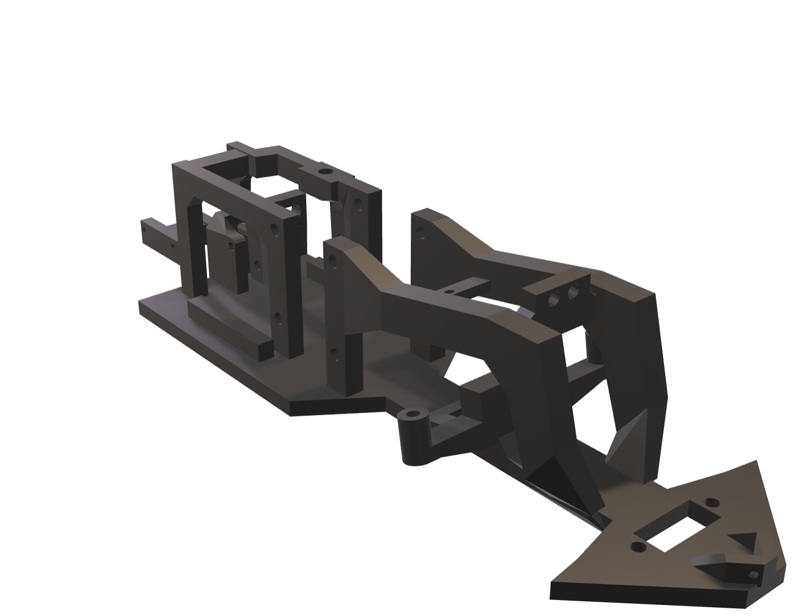
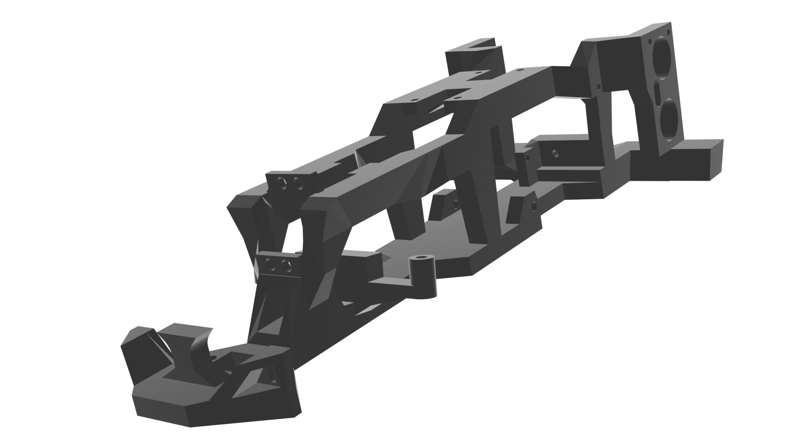
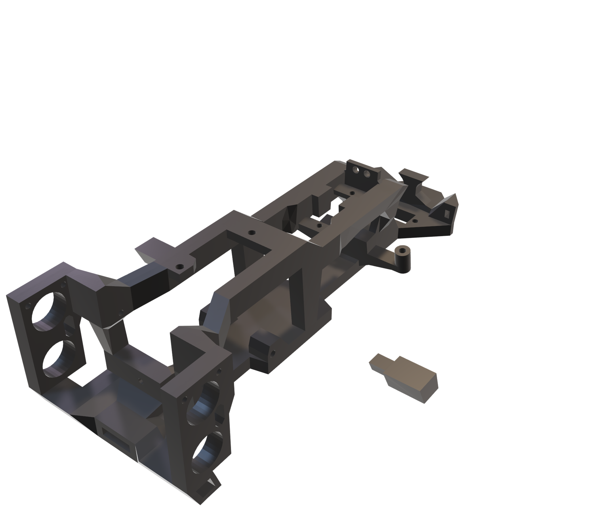
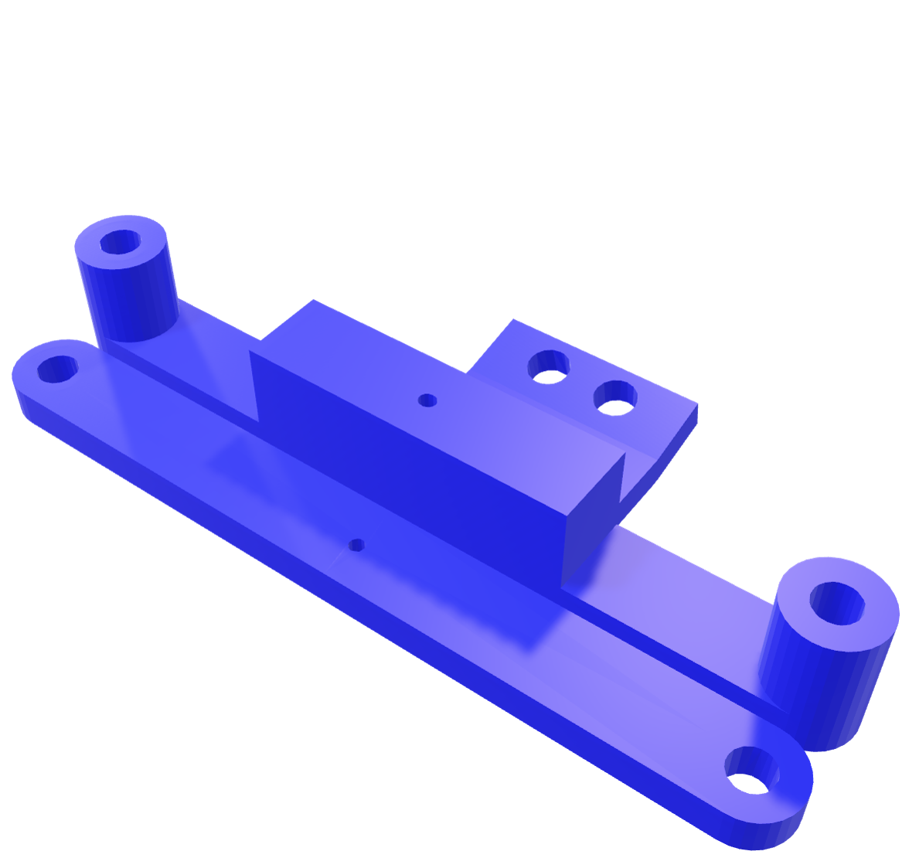
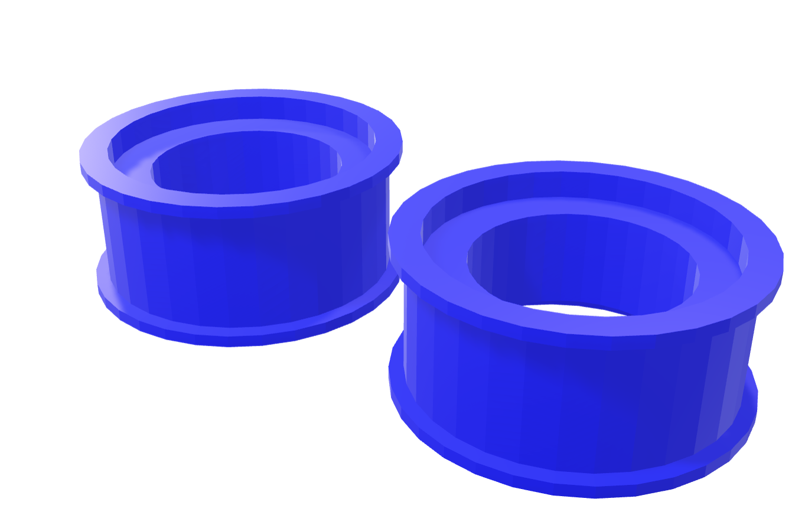

# Models Folder

Here you can find all the .stl and .glb models of every 3D modeled part of our robot.

The .glb models are used for the HTML embeds hosted in GitHub pages. 
We designed these embeds for a more interactive visualization of the models and their colors in the real-life robot. However, the .stl files can also be visualized directly in GitHub.

The designs included in this file directory are:

## 1. Chassis Model

| Old Model | New Robot | International Robot |
| :----------------: |  :----------------: |  :----------------: |
| [Chassis](./chassis/chassis.stl) | [New Chassis](./chassis/chassis2.0.stl) | [International Chassis](./chassis/ViZioInternationalMotorFix.stl) | |
|  |  |  |
| Visit the embed: [Chassis Embed](https://vizdrive.github.io/VizDrive_WRO2025/embeds/interactive_chassis)| Visit the updated embed: [Updated Chassis Embed](https://vizdrive.github.io/VizDrive_WRO2025/embeds/interactive_chassis2) | Visit the latest version: [International Chassis Embed](https://vizdrive.github.io/VizDrive_WRO2025/embeds/chassis_final) |

## 2. Steering

### 1. [Steering Rod and Camera Support](./steering/steering_rods.stl)

Visit the embed: [Steering Rod and Camera Support Embed](https://vizdrive.github.io/VizDrive_WRO2025/embeds/interactive_steering_rods)

## 3. Wheels Models

### 1. [Wheel Hubs](./wheels/wheel_hub.stl)

Visit the embed: [Wheels Hub Embed](https://vizdrive.github.io/VizDrive_WRO2025/embeds/interactive_hub)

### 2. [Rear Wheels](./wheels/encoder_wheel.stl)

Visit the embed: [Rear Wheels Embed](https://vizdrive.github.io/VizDrive_WRO2025/embeds/interactive_rear_wheels)

### 3. [Wheel Rims](./wheels/wheel_rims.stl)

Visit the embed: [Wheel Rims Embed](https://vizdrive.github.io/VizDrive_WRO2025/embeds/interactive_rims)

---

For an explanation on the design and 3D printing of these models, refer to the document: [**10. 3D Modeling**](../docs/10_3d_modeling.md)
