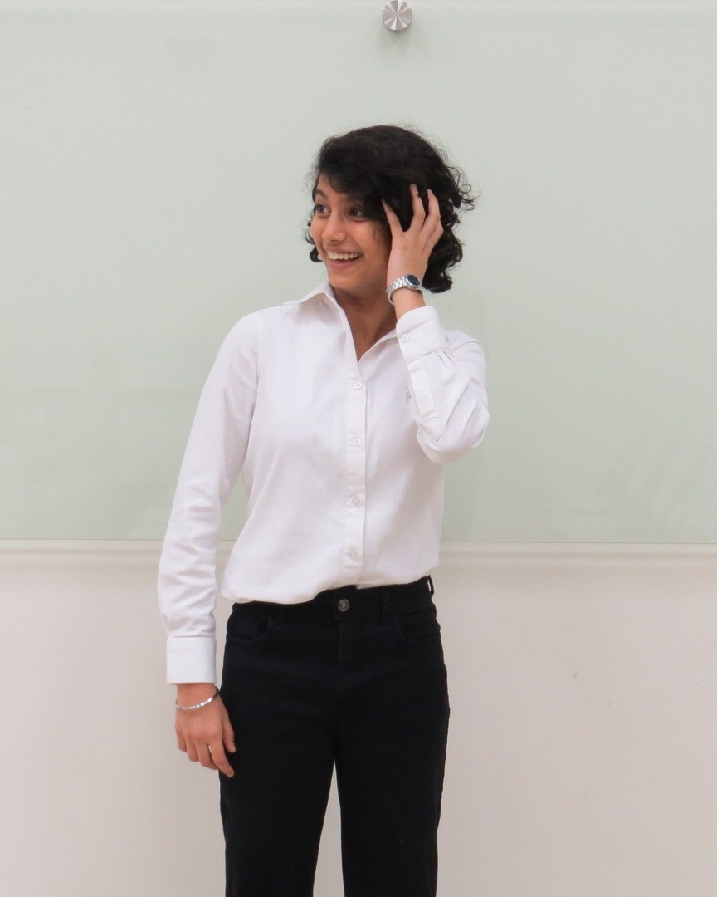

# Meet Aislinn Chawla Arora, the spark and the strategy behind the scenes!

Hi! I'm **Aislinn Chawla**, a 16-year-old Panamanian student whose passion for robotics began at 14, and since then, 
I’ve developed my programming skills through various projects and competitions. 
I’ve created a progressive web app for the **Technovation tournament** and competed multiple times in the **World Robotics Olympiad (WRO)**, 
earning a **national gold medal** and a **global silver medal** in **2023**.

I’m deeply **curious and passionate**, especially in **Math**, **Physics**, and **Chemistry**. 
I’ve represented my school in **academic competitions**, including winning **first place** in a **global Math championship in 2018**. 
I also enjoy language challenges, having competed in both **Spanish** and **English** grammar contests.

Beyond academics, I express myself through the **arts**—playing the **transverse flute** in a **music band** and exploring **painting** and **drawing**. 
I also stay active by playing **soccer** with friends and practicing **karate** at the **Nagasaki dojo**. 

I’m always eager to learn, grow, and **take on new challenges**.

