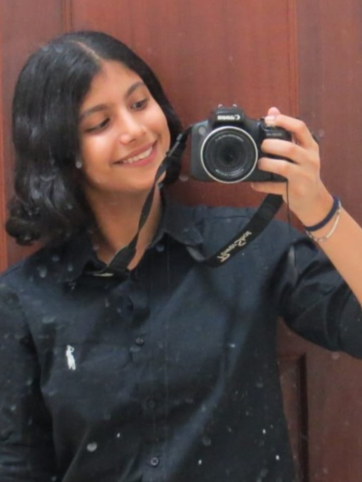

# Meet Aislinn Chawla Arora!
### The spark and the strategy behind the scenes!

Hi! I am **Aislinn Chawla**, a **17-year-old** Panamanian student from *Centro Cultural Chino Panameño, Instituto Sun Yat Sen*.

My interest in **Robotics** sparked when I was **14 years old**, and since then I’ve been developing my **programming** skills by coding a variety of projects for many tournaments, including: a progressive web app in the **Technovation tournament** during 2024 - 2026, and in the **World Robotics Olympiad (WRO)** many times, winning the **national gold medal** and, globally, a **silver medal** in **2023** with the project *Carey* (Future Innovators) and participating in **2024** with the project *ResQ-Bots* (Robo Mission). 

This year, I'm participating again in the **Future Engineers** category in the **WRO (World Robot Olympiad)** with **VizDrive**, after last year's success having, nationally a **gold medal** with a **perfect score**.

I am a **curious** and **passionate** person, excelling in the areas of **Mathematics**, **Physics**, and **Chemistry**, having participated in some of these competitions while representing my school, winning **first place** in a **global Math championship in 2018**, **second place** in the **National Panamanian Physics Olympiad in 2025** and **top 15% globally and national award** in the **International Physics Competition in 2026**.
On top of that, I’ve also been part of **Spanish** and **English grammar competitions**, participating in **Spanish Oratory** in 2025. Currently, I am in preparation for **Physics**, **Maths** and **Astronomy Olympics**.

In my spare time, I devote myself to continue **learning** and **exploring** the exciting field of **Robotics**.

Furthermore, my love for **arts** motivates me to take part in a **music band**, playing the **transverse flute** and **piccolo**, and expressing my creativity through **painting** or **drawing**. Apart from that, I enjoy training a lot, playing sports like **soccer** with my friends and learning **karate** in the *Nagasaki dojo*.

I aspire to keep **discovering** new things, gaining new **skills** and **enhancing** the ones I have.

