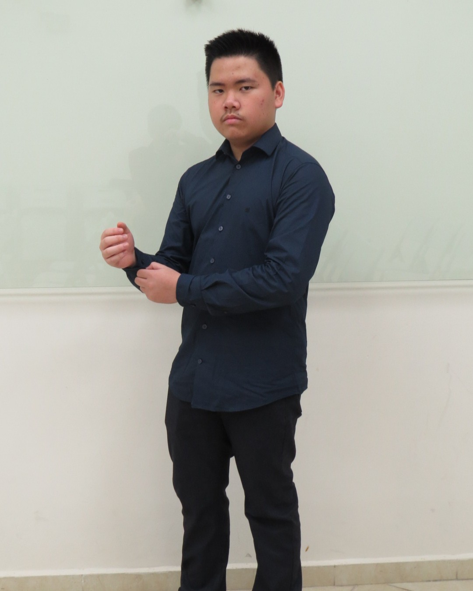

# Meet Carlo Ho Ng, the architect behind our circuits!

I'm **Carlo Ho Ng**, a 14-year-old student from Centro Cultural Chino Panameño, Instituto Sun Yat Sen. 

This year, I'm participating in the **Future Engineers category** in the **WRO** (World Robot Olympiad).

I have been part of this Olympiad since I was **12 years old**, with the team *Future Vision*, going to the international final and representing our country in **2023**. 
Later on, I teamed up with Alexis Palacios to create *AVTORESK*, being medalists in 2024. 

This time, we want to represent our country again in the world final with our team **VizDrive**.

I not only have an interest in **Robotics**, but I am immersed in the world of **3D modeling**, **animation**, **game and web application development** as well, which gives me skills to design our bot *ViZio*, 
while improving my **coding** abilities in various languages. 
However, I also enjoy art, such as music, vector illustration, and pencil sketching. 

I play in my school’s **marching band**; and, as another hobby, being a **multi-instrumentalist** and a **music producer**.

I have a high interest in **Mathematics**, participating in the **National Math Olympiad** since **2018**, becoming a **national champion** that year as well as winning many medals in the following years, 
though I’m also learning **physics** by myself, as preparation for my first **Physics Olympiad** next year. 
Moreover, in 2024, I participated in other competitions, like the Spanish spelling and Grammar competition.

Though I don’t excel in sports, I really like **table tennis** and **calisthenics**. I’ve been a student in *HiSaoLee martial arts*, participating in various tournaments. 
On the other hand, I've been interested in sports for mental agility, like **chess**.

My versatile persona displays my abilities in multiple fields; this year, focusing on **robotics** with my objective of **learning and improving myself**.

